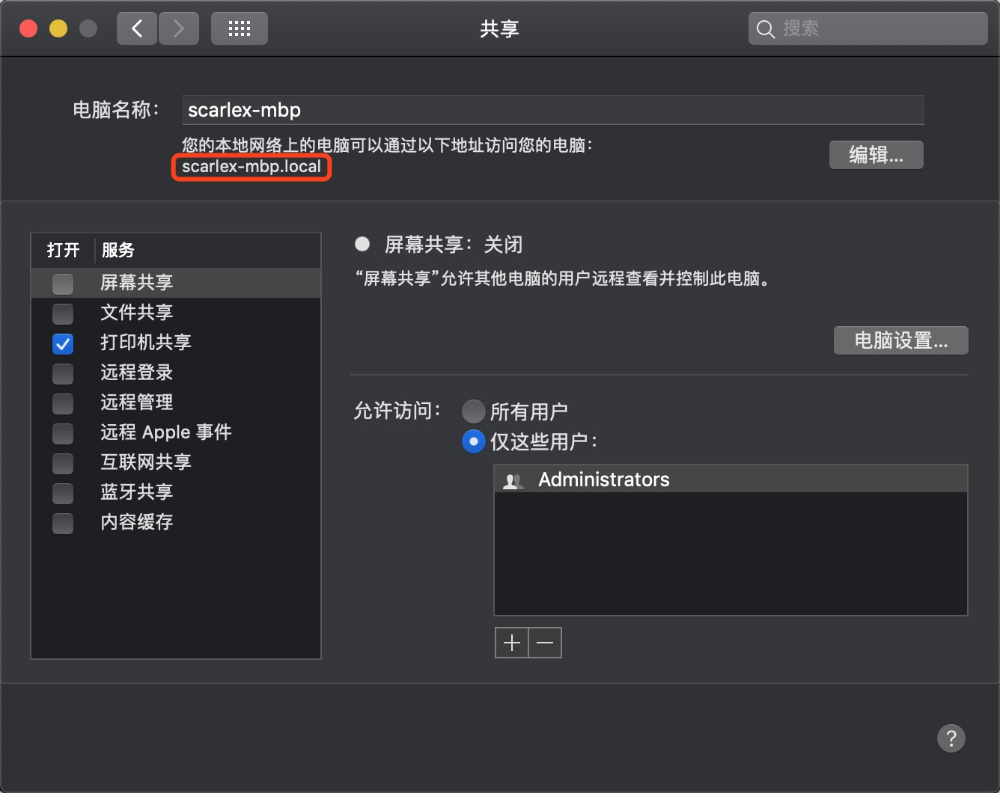
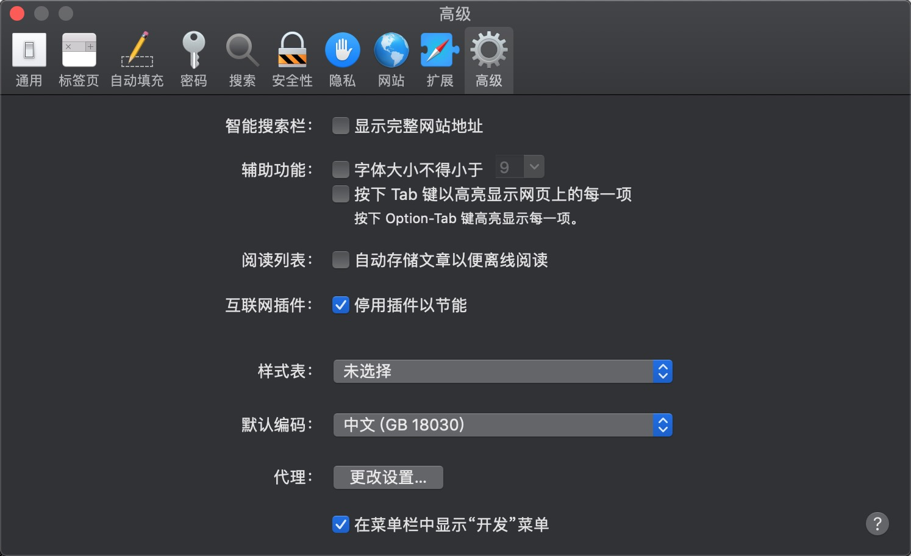

如今在移动设备上测试网站变得越来越重要了，我们会经常发现在移动设备的浏览器上面网站会表现 的和桌面浏览器不一样，因此在开发网站时用真机测试变得非常重要。
大多数在桌面电脑的开发服务器都只是在 `localhost` 中打开一个端口，然后通过 URL `http://localhost1234` 来访问内容。这种方式在电脑端非常管用，但你不可以把这个 URL 复制到手机端测试。 一种可行（通常都可以）但并不高明的方式是先查找电脑端当前的 IP 地址，然后移动端通过 `http://<ip-address-of-desktop>:<port>` 来访问网站。

然而，基于电脑端的 IP 地址来调试是非常烦人的，因为这个地址会经常发生变化。这意味着你不能保存该地址到书签中，而且当 IP 地址发生变化的时候，你将会丢失该域下的 数据，如 `cookies`, `localStorage` 等等。 然而，**有一种简单的方式去解决这个问题， 这种方式只需要设置一次，不会受到 IP 地址变化的影响，甚至不需要数据线！** 你只需要一台 Mac 和 Safari 即可。这个方案可以用在 macOS 10.12（Sierra）， 10.13（High Sierra），10.14（Mojave），可能可以用在更老的 macOS 版本中。


## 在你的移动设备中打开 localhost:port

先假设你的测试服务器在 `localhost` 中打开了 8080 端口。在你的电脑端，你当然可以打开 `localhost:8080` 来访问网网站了。现在我们要让你的移动设备来打开它。实际上，我们不会使用 `localhost:<port>` 或者 `<ip-address>:<port>`，因为有一种更好的方式来代替它：**计算机名**。
你可以在 `系统偏好设置` -> `共享` 中找到你的计算机名(注意，接下来我会用 `<computer-name>` 来指定计算机名)。
接下来你需要至少激活一种在列表中共享服务，激活哪个都没所谓。这可能有点蠢，或者你可以激活打印机共享，因为通常只有你会使用到。



现在确保你的 Mac 和 iOS 设备处在同一网络环境中，然后在你的 iOS 设备中打开 `http://<computer-name>.local:8080`。现在你的网站就会显示在你的 iOS 设备上了！

**你还是打不开网站吗？** 看起来你需要设置你的服务器，用 `0.0.0.0` 代替 `localhost` （并且允许从 `*.local` 建立的链接）。把你的 IP 地址改成 `0.0.0.0` 会让你的服务器可以从外部访问（在同一 WiFi 内）。

如果你正在使用 `webpack-dev-server` 的话，你只需要稍微改动一下配置就可以了。默认情况下，它会在 `localhost` 上创建服务器，并且不会允许外部链接（例如通过手机访问）。所以你需要修改一下 `webpack dev server` 的配置文件（准确来说就是 `host` 和 `allowedHosts` 字段）：

```
devServer: {
  host: '0.0.0.0',
  allowedHosts: [
    '.local',
  ],
},
```

注意我们添加 `.local` 到 `allowedHosts` 中，这会让所有 `.local` 结尾的 host 可以 访问到我们的网站，这样当我们需要共享的时候非常有用。 重启服务器，你的 iOS 设备应该可以正常访问网站了！如果你收到报错信息 `invalid host header` 的话，那很可能你的计算机名输错了。

实际上同一 WiFi 下的所有 iPhone， iPad，Mac 都可以访问到你开发环境中的网站的，而且 iOS 上的 Firefox 和 Chrome 都可以访问到。然而，你不可以在 Firefox 和 Chrome 中使用远程调试。


## 远程调试

现在你的手机和平板电脑都可以访问网站了，你可能通过它们来远程调试。设置起来是非常简单的。打开 Safari 的 `偏好设置` -> `高级` 然后启用 `在菜单栏中显示“开发”菜单`。



在移动端，启用 `设置` -> `Safari 浏览器` -> `高级` -> `Web 检查器`，然后用数据线连接你的 Mac。用移动端的 Safari 打开网站，然后在 Mac 上的 Safari 选择 `开发` -> `<设备名字>` -> `<你想调试的 Tab>`。如果你是第一次设置的话，那么你需要点击信任设备。

现在所有的设置已经完成了。当你点击 `<你想调试的 Tab>` 的时候，Mac 上的 Safari 会创建一个调试用的 session，它会允许你在 Mac 的 Safari 中调试 iOS 设备。


## 远程调试（无数据线）

其实你不需要用数据线连接电脑也可以远程调试移动端的 Safari 的，但这种情况下你需要在 Mac 上安装 [Safari Technology Preview](https://developer.apple.com/safari/technology-preview/)，因为当前稳定版的 Safari 并不支持无线远程调试。
重复上面做的事情，用数据线连接电脑然后打开 iOS 上的 Safari。在 Safari Technology Preview 中，确保你已经启用了 `在菜单栏中显示“开发”菜单`，然后启用 `Develop` -> `<Your mobile Device Name>` -> `Connect via Network`。现在你可以把数据线拔掉，看看 `Develop` -> `<Your mobile Device Name>` 是否还显示在 Safari Technology Preview 中。

然后选择你想调试的 Tab 就可以了。Safari Technology Preview 会在 macOS 中建立一条无线连接到 iOS 设备上，这样你就可以在 Mac 上调试 iPhone 和 iPad 了。看，不需要数据线吧。
Happy Testing!


## 译注

按照我的经验，用 Safari Technology Preview 来无线调试用起来是非常舒服的，但有个致命缺点就是非常不稳定。经常调试着调试着就搜不到设备了。
当出现这种情况的时候，可以试着把Safari Technology Preview 杀掉然后重启，看看能不能找到设备，如果找不到， 就把 iOS 上的 Safari 杀掉再重启，再测试。多试几次通常就能正常调试了。 
如果还是找不到，那过一段时间（通常是 5 ～ 10 分钟左右）再打开 Safari Technology Preview 试试。
实在不行又赶着调试的话，还是乖乖插上数据线调试算了。(然而体验过无线调试之后就回不去有线调试了 XD)。

完。


## 参考资料

- [(Wireless) Remote Debugging with Safari on iOS](https://silvantroxler.ch/2018/wireless-remote-debugging-with-safari-on-ios/)
