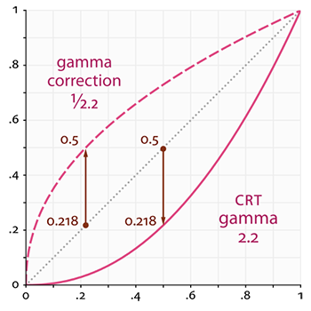

# 前言

最近在学习 Gamma 校正，本来在看 `OpenGL` 相关章节的时候觉得自己已经懂了，然后手贱翻了下知乎相关资料，突然又觉得自己什么懂不懂， 因为一旦提到 Gamma 校正，就会涉及到 sRGB 和 linear 色彩空间的相关知识点。

本文只是一篇记录学习 Gamma 校正过程中的笔记。

# 数学

首先放上一张经典的曲线图：

这张图上有三条线，分别是：

- 上方的红色虚线 A
- 中间的黑色虚线 B
- 下方的红色实线 C

这三条曲线非常特别，因为它们可以通过数学运算进行转化：

A 转换成 B 相当于 $ B = A^{2.2} $

B 转换成 C 相当于 $ C = B^{2.2} $

C 转换成 B 相当于 $ B = C^{1 \over 2.2} $

B 转换成 A 相当于 $ A = B^{1 \over 2.2} $

细心点可以发现，由上方曲线转成下方曲线，只需要计算 $ X^{2.2} $，由下方曲线转成上方曲线则是计算 $ X^{1 \over 2.2} $ 。

注意 X 的取之范围是 0 到 1。

# 人类视角亮度与物理亮度

看看下面这张图：

上面的是人类视觉对亮度感知，下面是物理上亮度的值。

从这张图可以看出，人类视觉认为 0.5 的亮度，实际上只有 0.2，而物理亮度是 0.5 的时候，人类视角会认为亮度是 0.7。

# Gamma 校正

# 总结

# 参考资料

- [维基百科 - sRGB色彩空间](https://zh.wikipedia.org/wiki/SRGB%E8%89%B2%E5%BD%A9%E7%A9%BA%E9%97%B4)
- [知乎 - 色彩校正中的 gamma 值是什么](https://www.zhihu.com/question/27467127/answer/123239180)
- [Gamma Correction](https://learnopengl.com/Advanced-Lighting/Gamma-Correction)
- [Linear-Space Lighting (i.e. Gamma)](http://filmicworlds.com/blog/linear-space-lighting-i-e-gamma/)

