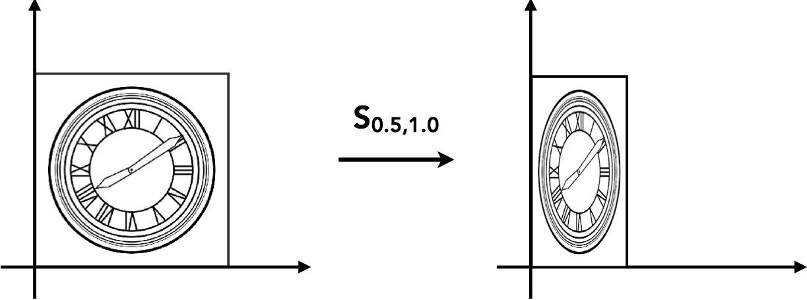
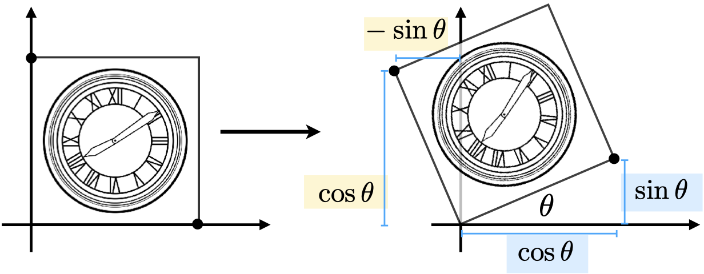
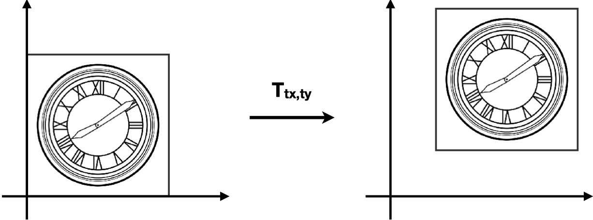
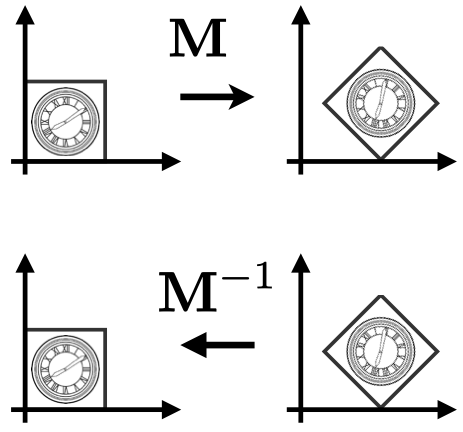

# 简介
本文《GAMES101-现代计算机图形学入门》系列教程的课程笔记，仅用于个人学习使用。

# 二维变换

二维变换是指二维在平面中进行的变换，一个二维的点经过变换后会得到变成另一个点（一个新的坐标）。

## 缩放

缩放是指点 $ (x_0, y_0) $ 经过缩放因子 $ S(x, y) $ 变换之后形成新的点 $ (x_1, y_1) $，它们间的关系是：

$$
x_1 = S_x \times x_0
$$

$$
y_1 = S_y \times y_0
$$

写成矩阵的形式就是：

$$
\begin{bmatrix} x_1 \\\ y_1 \end{bmatrix} =
\begin{bmatrix} S_x & 0 \\\ 0 & S_y \end{bmatrix}
\begin{bmatrix} x_0 \\\ y_0 \end{bmatrix}
$$

**镜像**是一个非常常见的缩放变换，只需要把缩放因子变成负数即可实现某个方向的镜像。如当缩放因子是 $ (-1, 1) $ 时，经过缩放变换之后的图形就是以 Y 轴为对称轴的镜像。

## 旋转

旋转是指绕一点作为旋转中心，旋转 $ \theta $ 角度的变换。 如上图所示，该正方形绕原点旋转了 $ \theta $ 角度。假设正方形的边长为 1，那么我们很容易可以得到如下的关系：

$$
\begin{bmatrix} x_1 \\\ y_1 \end{bmatrix} =
\begin{bmatrix} A & B \\\ C & D \end{bmatrix}
\begin{bmatrix} x_0 \\\ y_0 \end{bmatrix}
$$

对于右下角的点，变换前的坐标是 $ (1, 0) $，变换后的坐标是 $ (cos \theta, sin \theta) $， 我们可以得到如下的关系：

$$
\begin{bmatrix} cos \theta \\\ sin \theta \end{bmatrix} =
\begin{bmatrix} A & B \\\ C & D \end{bmatrix}
\begin{bmatrix} 1 \\\ 0 \end{bmatrix}
$$

$$
cos \theta = A \times 1 + B \times 0 = A
$$

$$
sin \theta = C \times 1 + D \times 0 = C
$$

同理，对于左上角的点，变换前的坐标为 $ (0, 1) $，变换后的坐标为 $ (-sin \theta, cos \theta) $，我们同样可以得到如下的关系：

$$
\begin{bmatrix} -sin \theta \\\ cos \theta \end{bmatrix} =
\begin{bmatrix} A & B \\\ C & D \end{bmatrix}
\begin{bmatrix} 0 \\\ 1 \end{bmatrix}
$$

$$
-sin \theta = A \times 0 + B \times 1 = B
$$

$$
cos \theta = C \times 0 + D \times 1 = D
$$

这样我们就得到了旋转矩阵：

$$
R_\theta = \begin{bmatrix} cos \theta & -sin \theta \\\ sin \theta & cos \theta \end{bmatrix}
$$

## 线性变换

通过上面的例子我们可以发现，缩放和旋转都能以线性变换的形式来表示，即：

$$
x_1 = ax_0 + by_0
$$

$$
y_1 = cx_0 + dy_0
$$

以矩阵的形式来表示即：

$$
\begin{bmatrix} x_1 \\\ y_1 \end{bmatrix} =
\begin{bmatrix} A & B \\\ C & D \end{bmatrix}
\begin{bmatrix} x_0 \\\ y_0 \end{bmatrix}
$$

如果变换可以通过以矩阵M 与点相乘然后得到一个新的点的话，那么这种变换就可以称为是线性变换。

## 平移

平移就是把 $ (x, y) $ 移动一段距离 $ (T_x, T_y) $ 然后得到一个新的坐标，即：

$$
x_1 = x_0 + T_x
$$

$$
y_1 = y_0 + T_y
$$

## 齐次坐标

观察平移的公式后可以发现，我们不能像缩放和旋转那样写出一个类似的平移矩阵。我们必须把带有平移的变换写成如下的形式：

$$
\begin{bmatrix} x_1 \\\ y_1 \end{bmatrix} =
\begin{bmatrix} A & B \\\ C & D \end{bmatrix}
\begin{bmatrix} x_0 \\\ y_0 \end{bmatrix}
+ 
\begin{bmatrix} T_x \\\ T_y \end{bmatrix}
$$

我们希望有一个工具来统一所有变换，这个工具就是 —— 齐次坐标。

齐次坐标是再给点、向量增加一个 w 维度：

- 2D 点： $ (x, y, 1) $
- 2D 向量： $ (x, y, 0) $

当点、向量增加一个 w 纬度之后，我们就可以把上述带有平移的变换写成如下的形式：

$$
\begin{bmatrix} x_1 \\\ y_1 \\\ w_1 \end{bmatrix} =
\begin{bmatrix} A & B & T_x \\\ C & D & T_y \\\ 0 & 0 & 1 \end{bmatrix}
\begin{bmatrix} x_0 \\\ y_0 \\\ w_0 \end{bmatrix}
$$

因此，在齐次坐标下，我们就可以用一个矩阵来同时表示平移、旋转、缩放三种变换了。

并且，由于向量具有平移不变性，因此 w 为 0 的时候刚好能保证平移矩阵与向量相乘时，w 分量依然保持 0，如：

$$
\begin{bmatrix} x_1 \\\ y_1 \\\ w_1 \end{bmatrix} =
\begin{bmatrix} 1 & 0 & T_x \\\ 0 & 1 & T_y \\\ 0 & 0 & 1 \end{bmatrix}
\begin{bmatrix} x_0 \\\ y_0 \\\ 0 \end{bmatrix} =
\begin{bmatrix} x_0 + T_x \\\ y_0 + T_y \\\ 0 \end{bmatrix}
$$

另外，对于 w 分量，还有些相关的结论：

- 向量 + 向量 = 向量
  - 因为 $ w_1 + w_2 = 0 $
- 点 - 点 = 向量
  - 因为 $ w_1 - w_2 = 0 $
- 点 + 向量 = 点
  - 因为 $ w_1 + w_2 = 1 $
- 点 + 点 = 这两点的中点
  - 因为 $ w_1 + w_2 = 2 $，在齐次坐标下，点的 w 分量为 1，所以结果要除以 2，得到的结果正是两点的中点位置

## 逆变换

逆变换是指把已应用的变换还原的变换，在数学上是指变换矩阵的逆矩阵 $ M^{-1} $。

## 仿射变换

$$
仿射变换 = 线性变换 + 平移
$$

$$
\begin{bmatrix} x_1 \\\ y_1 \end{bmatrix} =
\begin{bmatrix} A & B \\\ C & D \end{bmatrix}
\begin{bmatrix} x_0 \\\ y_0 \end{bmatrix}
+
\begin{bmatrix} T_x \\\ T_y \end{bmatrix}
$$

其对应的齐次坐标的形式为：

$$
\begin{bmatrix} x_1 \\\ y_1 \\\ 1 \end{bmatrix} =
\begin{bmatrix} A & B & T_x \\\ C & D & T_y \\\ 0 & 0 & 1 \end{bmatrix}
\begin{bmatrix} x_0 \\\ y_0 \\\ 1 \end{bmatrix}
$$

相对于仿射变换，齐次坐标有如下优点：

- 可以用一个矩阵来表示平移、旋转、缩放三种变换。
- 逆变换可以通过逆矩阵来表示。

我们可以把平移、旋转、缩放三种变换分别以齐次坐标的形式表示：

$$
T_{(x, y)} = \begin{bmatrix} 0 & 0 & T_x \\\ 0 & 0 & T_y \\\ 0 & 0 & 1 \end{bmatrix}
$$

$$
R_{(\theta)} = \begin{bmatrix} cos \theta & -sin \theta & 0 \\\ sin \theta & cos \theta & 0 \\\ 0 & 0 & 1 \end{bmatrix}
$$

$$
S_{(x, y)} = \begin{bmatrix} S_x & 0 & 0 \\\ 0 & S_y & 0 \\\ 0 & 0 & 1 \end{bmatrix}
$$

**在仿射变换下，变换的先后顺序是先进行线性变换，然后再进行平移变换。**

## 组合变换

矩阵乘法没有交换律，所以两种变换是不能调换顺序的。
即先平移再旋转并不等于先旋转再平移的结果。因此，应用变换的顺序很重要。

而在应用变换的时候，是根据从右往左的顺序来进行的。

$$
T \cdot R \cdot \begin{bmatrix} x \\\ y \\\ 1 \end{bmatrix}
$$

上面这个变换表示先进行旋转，然后再进行平移。

矩阵乘法满足结合律，因此有：

$$
A_n( \cdots A_2( A_1 \cdot \begin{bmatrix} x \\\ y \\\ 1 \end{bmatrix} ) = 
A_n \cdots A_2 \cdot A_1 \cdot \begin{bmatrix} x \\\ y \\\ 1 \end{bmatrix}
$$

观察右边的式子，我们可以预先计算 $ T = A_n \cdots A_2 \cdot A_1 $，然后直接 $ T \cdot \begin{bmatrix} x \\\ y \\\ 1 \end{bmatrix} $ 即可。这是一种优化计算的手段。

## 分解复杂变换

默认情况下，旋转是绕原点进行的。如果想自定义旋转中心，可以通过如下的组合变换来实现：

1. 把旋转中心平移到原点
2. 进行旋转
3. 把旋转中心平移回原来的位置

# 三维变换

在齐次坐标下，

- 3D 点表示为 $ (x, y, z, 1) $
- 3D 向量表示为 $ (x, y, z, 0) $

通常，$ (x, y, z, w) $ 在 $ w \ne 0 $ 时表示为一个 3D 的点，它的坐标为 $ (x/w, y/w, z/w) $。

我们会用一个 $ 4 \times 4 $ 的矩阵来表示三维变换：

$$
\begin{bmatrix} x_1 \\\ y_1 \\\ z_1 \\\ 1 \end{bmatrix} =
\begin{bmatrix} A & B & C & T_x \\\ D & E & F & T_y \\\ G & H & I & T_z  \\\ 0 & 0 & 0 & 1 \end{bmatrix}
\begin{bmatrix} x_0 \\\ y_0 \\\ z_0 \\\ 1 \end{bmatrix}
$$

## 正交矩阵

$$
R_\theta = \begin{bmatrix} cos \theta & -sin \theta \\\ sin \theta & cos \theta \end{bmatrix}
$$

$$
R_{-\theta} = \begin{bmatrix} cos \theta & sin \theta \\\ -sin \theta & cos \theta \end{bmatrix}
$$

$$
{R_\theta}^T = \begin{bmatrix} cos \theta & sin \theta \\\ -sin \theta & cos \theta \end{bmatrix}
$$

$$
R_{-\theta} = {R_\theta}^T
$$

当一个矩阵的逆矩阵等于该矩阵的转置矩阵时，这个矩阵称为正交矩阵。

## 观测变换

# 参考资料

[Lecture 03 Transformation](https://www.bilibili.com/video/BV1X7411F744?p=3)

[Lecture 04 Transformation Cont.](https://www.bilibili.com/video/BV1X7411F744?p=4)

