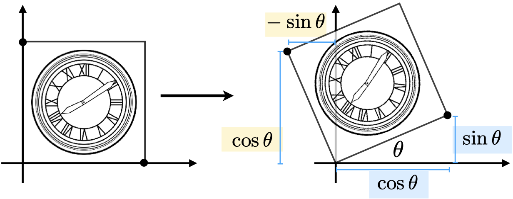
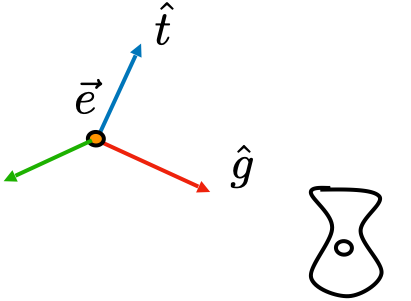
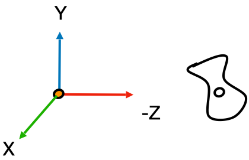
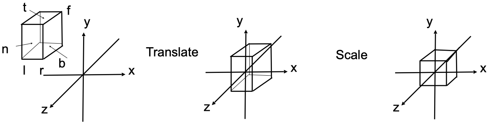
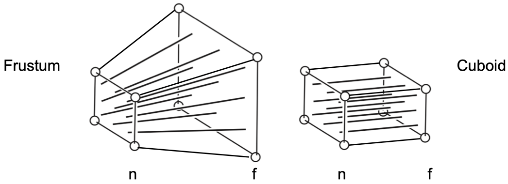
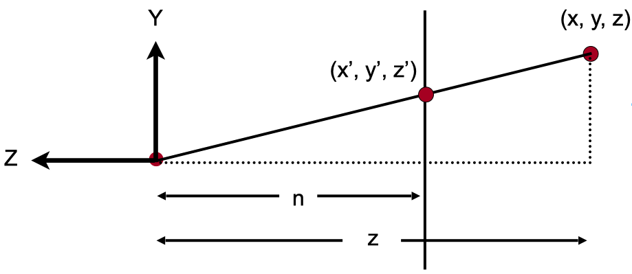
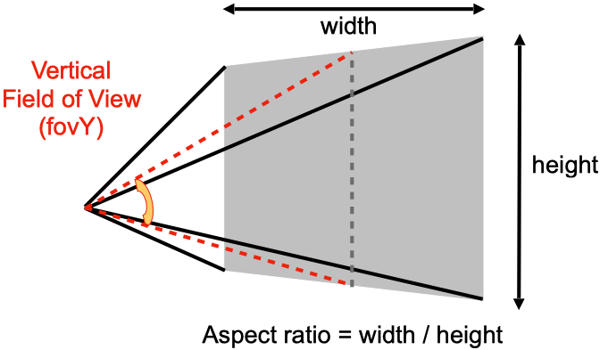
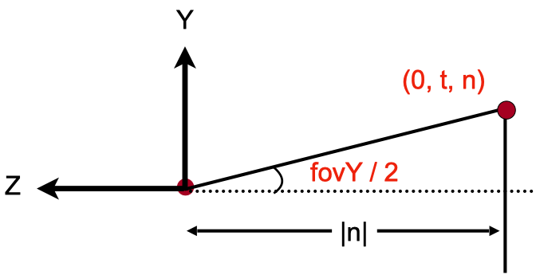

# 简介
本文《GAMES101-现代计算机图形学入门》系列教程的课程笔记，仅用于个人学习使用。


# 二维变换

二维变换是指二维在平面中进行的变换，一个二维的点经过变换后会得到变成另一个点（一个新的坐标）。

## 缩放


缩放是指点 $ (x_0, y_0) $ 经过缩放因子 $ S(x, y) $ 变换之后形成新的点 $ (x_1, y_1) $，它们间的关系是：

$$
x_1 = S_x \times x_0
$$

$$
y_1 = S_y \times y_0
$$

写成矩阵的形式就是：

$$
\begin{bmatrix} x_1 \\\ y_1 \end{bmatrix} =
\begin{bmatrix} S_x & 0 \\\ 0 & S_y \end{bmatrix}
\begin{bmatrix} x_0 \\\ y_0 \end{bmatrix}
$$

**镜像**是一个非常常见的缩放变换，只需要把缩放因子变成负数即可实现某个方向的镜像。如当缩放因子是 $ (-1, 1) $ 时，经过缩放变换之后的图形就是以 Y 轴为对称轴的镜像。


## 旋转



旋转是指绕一点作为旋转中心，旋转 $ \theta $ 角度的变换。 如上图所示，该正方形绕原点旋转了 $ \theta $ 角度。假设正方形的边长为 1，那么我们很容易可以得到如下的关系：

$$
\begin{bmatrix} x_1 \\\ y_1 \end{bmatrix} =
\begin{bmatrix} A & B \\\ C & D \end{bmatrix}
\begin{bmatrix} x_0 \\\ y_0 \end{bmatrix}
$$

对于右下角的点，变换前的坐标是 $ (1, 0) $，变换后的坐标是 $ (cos \theta, sin \theta) $， 我们可以得到如下的关系：

$$
\begin{bmatrix} cos \theta \\\ sin \theta \end{bmatrix} =
\begin{bmatrix} A & B \\\ C & D \end{bmatrix}
\begin{bmatrix} 1 \\\ 0 \end{bmatrix}
$$

$$
cos \theta = A \times 1 + B \times 0 = A
$$

$$
sin \theta = C \times 1 + D \times 0 = C
$$

同理，对于左上角的点，变换前的坐标为 $ (0, 1) $，变换后的坐标为 $ (-sin \theta, cos \theta) $，我们同样可以得到如下的关系：

$$
\begin{bmatrix} -sin \theta \\\ cos \theta \end{bmatrix} =
\begin{bmatrix} A & B \\\ C & D \end{bmatrix}
\begin{bmatrix} 0 \\\ 1 \end{bmatrix}
$$

$$
-sin \theta = A \times 0 + B \times 1 = B
$$

$$
cos \theta = C \times 0 + D \times 1 = D
$$

这样我们就得到了旋转矩阵：

$$
R_\theta = \begin{bmatrix} cos \theta & -sin \theta \\\ sin \theta & cos \theta \end{bmatrix}
$$


## 线性变换

通过上面的例子我们可以发现，缩放和旋转都能以线性变换的形式来表示，即：

$$
x_1 = ax_0 + by_0
$$

$$
y_1 = cx_0 + dy_0
$$

以矩阵的形式来表示即：

$$
\begin{bmatrix} x_1 \\\ y_1 \end{bmatrix} =
\begin{bmatrix} A & B \\\ C & D \end{bmatrix}
\begin{bmatrix} x_0 \\\ y_0 \end{bmatrix}
$$

如果变换可以通过以矩阵M 与点相乘然后得到一个新的点的话，那么这种变换就可以称为是线性变换。


## 平移


平移就是把 $ (x, y) $ 移动一段距离 $ (T_x, T_y) $ 然后得到一个新的坐标，即：

$$
x_1 = x_0 + T_x
$$

$$
y_1 = y_0 + T_y
$$


## 齐次坐标

观察平移的公式后可以发现，我们不能像缩放和旋转那样写出一个类似的平移矩阵。我们必须把带有平移的变换写成如下的形式：

$$
\begin{bmatrix} x_1 \\\ y_1 \end{bmatrix} =
\begin{bmatrix} A & B \\\ C & D \end{bmatrix}
\begin{bmatrix} x_0 \\\ y_0 \end{bmatrix}
+ 
\begin{bmatrix} T_x \\\ T_y \end{bmatrix}
$$

我们希望有一个工具来统一所有变换，这个工具就是 —— 齐次坐标。

齐次坐标是再给点、向量增加一个 w 维度：

- 2D 点： $ (x, y, 1) $
- 2D 向量： $ (x, y, 0) $

当点、向量增加一个 w 纬度之后，我们就可以把上述带有平移的变换写成如下的形式：

$$
\begin{bmatrix} x_1 \\\ y_1 \\\ w_1 \end{bmatrix} =
\begin{bmatrix} A & B & T_x \\\ C & D & T_y \\\ 0 & 0 & 1 \end{bmatrix}
\begin{bmatrix} x_0 \\\ y_0 \\\ w_0 \end{bmatrix}
$$

因此，在齐次坐标下，我们就可以用一个矩阵来同时表示平移、旋转、缩放三种变换了。

并且，由于向量具有平移不变性，因此 w 为 0 的时候刚好能保证平移矩阵与向量相乘时，w 分量依然保持 0，如：

$$
\begin{bmatrix} x_1 \\\ y_1 \\\ w_1 \end{bmatrix} =
\begin{bmatrix} 1 & 0 & T_x \\\ 0 & 1 & T_y \\\ 0 & 0 & 1 \end{bmatrix}
\begin{bmatrix} x_0 \\\ y_0 \\\ 0 \end{bmatrix} =
\begin{bmatrix} x_0 + T_x \\\ y_0 + T_y \\\ 0 \end{bmatrix}
$$


另外，对于 w 分量，还有些相关的结论：

- 向量 + 向量 = 向量
  - 因为 $ w_1 + w_2 = 0 $
- 点 - 点 = 向量
  - 因为 $ w_1 - w_2 = 0 $
- 点 + 向量 = 点
  - 因为 $ w_1 + w_2 = 1 $
- 点 + 点 = 这两点的中点
  - 因为 $ w_1 + w_2 = 2 $，在齐次坐标下，点的 w 分量为 1，所以结果要除以 2，得到的结果正是两点的中点位置


## 逆变换


逆变换是指把已应用的变换还原的变换，在数学上是指变换矩阵的逆矩阵 $ M^{-1} $。


## 仿射变换

$$
仿射变换 = 线性变换 + 平移
$$

$$
\begin{bmatrix} x_1 \\\ y_1 \end{bmatrix} =
\begin{bmatrix} A & B \\\ C & D \end{bmatrix}
\begin{bmatrix} x_0 \\\ y_0 \end{bmatrix}
+
\begin{bmatrix} T_x \\\ T_y \end{bmatrix}
$$

其对应的齐次坐标的形式为：

$$
\begin{bmatrix} x_1 \\\ y_1 \\\ 1 \end{bmatrix} =
\begin{bmatrix} A & B & T_x \\\ C & D & T_y \\\ 0 & 0 & 1 \end{bmatrix}
\begin{bmatrix} x_0 \\\ y_0 \\\ 1 \end{bmatrix}
$$

相对于仿射变换，齐次坐标有如下优点：

- 可以用一个矩阵来表示平移、旋转、缩放三种变换。
- 逆变换可以通过逆矩阵来表示。

我们可以把平移、旋转、缩放三种变换分别以齐次坐标的形式表示：

$$
T_{(x, y)} = \begin{bmatrix} 0 & 0 & T_x \\\ 0 & 0 & T_y \\\ 0 & 0 & 1 \end{bmatrix}
$$

$$
R_{(\theta)} = \begin{bmatrix} cos \theta & -sin \theta & 0 \\\ sin \theta & cos \theta & 0 \\\ 0 & 0 & 1 \end{bmatrix}
$$

$$
S_{(x, y)} = \begin{bmatrix} S_x & 0 & 0 \\\ 0 & S_y & 0 \\\ 0 & 0 & 1 \end{bmatrix}
$$

**在仿射变换下，变换的先后顺序是先进行线性变换，然后再进行平移变换。**

## 组合变换

矩阵乘法没有交换律，所以两种变换是不能调换顺序的。
即先平移再旋转并不等于先旋转再平移的结果。因此，应用变换的顺序很重要。

而在应用变换的时候，是根据从右往左的顺序来进行的。

$$
T \cdot R \cdot \begin{bmatrix} x \\\ y \\\ 1 \end{bmatrix}
$$

上面这个变换表示先进行旋转，然后再进行平移。

矩阵乘法满足结合律，因此有：

$$
A_n( \cdots A_2( A_1 \cdot \begin{bmatrix} x \\\ y \\\ 1 \end{bmatrix} ) = 
A_n \cdots A_2 \cdot A_1 \cdot \begin{bmatrix} x \\\ y \\\ 1 \end{bmatrix}
$$

观察右边的式子，我们可以预先计算 $ T = A_n \cdots A_2 \cdot A_1 $，然后直接 $ T \cdot \begin{bmatrix} x \\\ y \\\ 1 \end{bmatrix} $ 即可。这是一种优化计算的手段。


## 分解复杂变换

默认情况下，旋转是绕原点进行的。如果想自定义旋转中心，可以通过如下的组合变换来实现：

1. 把旋转中心平移到原点
2. 进行旋转
3. 把旋转中心平移回原来的位置


# 三维变换

三维变换与二维变换类似，只是多了一个 z 维度。在齐次坐标下，

- 3D 点表示为 $ (x, y, z, 1) $
- 3D 向量表示为 $ (x, y, z, 0) $

通常，$ (x, y, z, w) $ 在 $ w \ne 0 $ 时表示为一个 3D 的点，它的坐标为 $ (x/w, y/w, z/w) $。

我们会用一个 $ 4 \times 4 $ 的矩阵来表示三维变换：

$$
\begin{bmatrix} x_1 \\\ y_1 \\\ z_1 \\\ 1 \end{bmatrix} =
\begin{bmatrix} A & B & C & T_x \\\ D & E & F & T_y \\\ G & H & I & T_z  \\\ 0 & 0 & 0 & 1 \end{bmatrix}
\begin{bmatrix} x_0 \\\ y_0 \\\ z_0 \\\ 1 \end{bmatrix}
$$

## 正交矩阵

仔细观察一下旋转矩阵，和它的逆矩阵、转置矩阵，我们会发现一个有趣的现象：

$$
R_\theta = \begin{bmatrix} cos \theta & -sin \theta \\\ sin \theta & cos \theta \end{bmatrix}
$$

$$
R_{-\theta} = \begin{bmatrix} cos \theta & sin \theta \\\ -sin \theta & cos \theta \end{bmatrix}
$$

$$
{R_\theta}^T = \begin{bmatrix} cos \theta & sin \theta \\\ -sin \theta & cos \theta \end{bmatrix}
$$

<div>
$$
R_{-\theta} = {R_\theta}^T
$$
</div>

旋转矩阵的逆矩阵与它的转置矩阵相同。我们可以利用旋转矩阵的这个性质来求它的逆矩阵。

另外，当一个矩阵的逆矩阵等于该矩阵的转置矩阵时，这个矩阵称为正交矩阵，因此旋转矩阵也是一个正交矩阵。


## 观测变换 (Viewing Transformation)

观测变换是为了把三维空间变换成二维空间（屏幕），它由两部分组成：

- 视图变换 (View Transformation)
- 投影变换 (Projection Transformation)
  - 正交投影
  - 透视投影


## 视图变换

摄像机与物体的相对距离，会影响最终图像的效果。换句话说，无论是移动物体还是移动摄像机，只要保持两者的相对距离不变，那么我们就能得到相同的图像。

因此，我们可以把摄像机放到原点位置，朝向 -Z 方向，其他物体与摄像机保持相对位置不变，我们就能得到与世界空间下拍摄到的一样的图像了。

视图变换是用来把世界空间变换成摄像机空间。如下图所示：



(世界空间)



(摄像机空间)

要确定视图变换，我们需要确定三个变量：

1. 摄像机的位置
2. 目标位置
3. 摄像机的上方向

如何世界空间下的摄像机变换成视图空间呢？我们可以通过以下步骤：

1. 把摄像机移动到原点
2. 把摄像机的上方向调整成与 Y 一致，并让摄像机往 -Z 方向看

这些步骤就是视图变换（View Transformation）了，即：

<div>
$$
M_{view} = R_{view} \cdot T_{view}
$$
</div>

假设摄像机所在的世界坐标是 $ (x, y, z) $，那么：

<div>
$$
T_{view} = \begin{bmatrix} 1 & 0 & 0 & -x \\\ 0 & 1 & 0 & -y \\\ 0 & 0 & 1 & -z \\\ 0 & 0 & 0 & 1 \end{bmatrix}
$$
</div>

假设摄像机的的上方向为 $ \hat t $，同时往 $ \hat g $ 方向看，由于 $ \hat e $、$ \hat t $、$ \hat g $ 是摄像机的本地坐标系，因此三者相互垂直，所有有：

$$
\hat e = \hat g \times \hat t
$$

接下来需要求 $ R_{view} $，它是一个把摄像机的本地坐标系旋转成标准直角坐标系的变换，直接计算会比较复杂。

幸运的是，我们可以利用旋转矩阵是正交矩阵的特性，来求 $ R_{view} $。

首先求它的逆矩阵：

<div>
$$
{R_{view}}^{-1}
\begin{bmatrix}
x_{\hat g \times \hat t} & x_t & x_{-g} & 0 \\\ 
y_{\hat g \times \hat t} & y_t & y_{-g} & 0 \\\ 
z_{\hat g \times \hat t} & z_t & z_{-g} & 0 \\\ 
0 & 0 & 0 & 1
\end{bmatrix}
$$
</div>

然后再进行一次转置操作即可：

<div>
$$
R_{view} = {{R_{view}}^{-1}}^T =
\begin{bmatrix}
x_{\hat g \times \hat t} & y_{\hat g \times \hat t} & z_{\hat g \times \hat t} & 0 \\\
x_t & y_t & z_t & 0 \\\
x_{-g} & y_{-g} & z_{-g} & 0 \\\
0 & 0 & 0 & 1
\end{bmatrix}
$$
</div>

最后，我们就可以得到视图矩阵：

<div>
$$
M_{view} =
R_{view} \cdot T_{view} =
\begin{bmatrix}
x_{\hat g \times \hat t} & y_{\hat g \times \hat t} & z_{\hat g \times \hat t} & -x \\\
x_t & y_t & z_t & -y \\\
x_{-g} & y_{-g} & z_{-g} & -z \\\
0 & 0 & 0 & 1
\end{bmatrix}
$$
</div>


## 投影变换

投影矩阵的作用是把三维空间变换成二维空间，即图片。

常见的投影有两种：

- 正交投影（不会出现近大远小的现象）
- 透视投影（会出现近大远小的现象，透视投影下的平行线最终会汇聚在一点）


### 正交投影



在图形学中，正交投影是把 $ [l, r] \times [b, t] \times [f, n] $ 构成的空间压缩成 $ [-1, 1]^3 $ 的立方体中。

其中：

- l = left
- r = right
- b = bottom
- t = top
- f = far
- n = near

**注意：因为摄像机是朝 -Z 方向的，所以 n > f。**

要确定正交投影矩阵，需要经过以下步骤：

1. 把空间平移到原点（空间的中心与原点重合）
2. 把空间压缩成 $ [-1, 1]^3 $

即：

<div>
$$
M_{ortho} = S_{ortho} \cdot T_{ortho}
$$
</div>

由于我们知道空间的六个面，因此这个空间的中心就是：$ (\frac {l + r} 2, \frac {b + t} 2, \frac {f + n} 2) $，那么就有：

<div>
$$
T_{ortho} =
\begin{bmatrix}
1 & 0 & 0 & -{\frac {r + l} 2} \\\
0 & 1 & 0 & -{\frac {t + b} 2} \\\
0 & 0 & 1 & -{\frac {f + n} 2} \\\
0 & 0 & 0 & 1
\end{bmatrix}
$$
</div>

下一步就是压缩空间了，这一步骤相当于进行一次缩放，把当前空间缩放到大小为 2 的立方体。

以空间的 X 方向为例，其长度为 $ r - l $，因此 X 方向的缩放因子就是:

$$
(r - l) \times S_x = 2
$$

$$
S_x = \frac 2 {r - l}
$$

同理可求出 $ S_y $ 和 $ S_z $，然后得到：

<div>
$$
S_{ortho} =
\begin{bmatrix}
\frac 2 {r - l} & 0 & 0 & 0 \\\
0 & \frac 2 {t - b} & 0 & 0 \\\
0 & 0 & \frac 2 {n - f} & 0 \\\
0 & 0 & 0 & 1
\end{bmatrix}
$$
</div>

最后，正交投影矩阵为：

<div>
$$
M_{ortho} =
S_{ortho} \cdot T_{ortho} =
\begin{bmatrix}
\frac 2 {r - l} & 0 & 0 & -{\frac {r + l} {r - l}} \\\
0 & \frac 2 {t - b} & 0 & -{\frac {t + b} {t - b}} \\\
0 & 0 & \frac 2 {n - f} & -{\frac {f + n} {f - n}} \\\
0 & 0 & 0 & 1
\end{bmatrix}
$$
</div>


### 透视投影



透视投影与正交投影类似，也是经过类似的步骤：

1. 把空间平移到原点
2. 把空间压缩成长方体（近平面不变，压缩远平面）
3. 把空间压缩成 $ [-1, 1]^3 $ 的立方体（进行一次正交投影）

相比正交投影，透视投影多了一个步骤，就是把视锥体变换成长方体，这个变换暂且叫做 $ M_{p->o} $。
要计算这个变换，我们需要先知道这个变换过程发生了什么。


下图是 YZ 平面的截面：



经过压缩后，对于 y 坐标，空间中的一点 $ (x, y, z) $ 会变成 $ (x, y^{\prime}, z) $，根据相似三角形的性质，我们会得到如下的等式：

$$
\frac n z = \frac {y^{\prime}} y
$$

$$
y^{\prime} = \frac n z y
$$

同理，对于 x 坐标，我们也能得到类似的等式：

$$
x^{\prime} = \frac n z x
$$

然后，我们就能得到如下的结果：

<div>
$$
M_{persp -> ortho}

\begin{bmatrix}
x \\\
y \\\
z \\\
1
\end{bmatrix}

=

\begin{bmatrix}
\frac {nx} z \\\
\frac {ny} z \\\
unknow \\\
1
\end{bmatrix}
$$
</div>

再稍微变换一下写法（乘以z），我们能得到：

<div>
$$
M_{persp -> ortho}

\begin{bmatrix}
x \\\
y \\\
z \\\
1
\end{bmatrix}

=

\begin{bmatrix}
nx \\\
ny \\\
unknow \\\
z
\end{bmatrix}
$$
</div>

计算一下 $ M_{persp -> ortho} $，矩阵的第一行，可以得到：

$$
ax + by + cz + d = nx
$$

于是有

$$
a = n
$$

$$
b = 0
$$

$$
c = 0
$$

$$
d = 0
$$

我们可以用同样的方法去计算矩阵的其它行，于是就能得到矩阵的雏形：

<div>
$$
M_{persp -> ortho} =
\begin{bmatrix}
n & 0 & 0 & 0 \\\
0 & n & 0 & 0 \\\
? & ? & ? & ? \\\
0 & 0 & 1 & 0
\end{bmatrix}
$$
</div>

矩阵的第三行是表示 z 方向的变换的，而我们知道有两个事实：

- 任何在近平面的点，都不会发生变化，即：

<div>
$$
\begin{bmatrix}
? & ? & ? & ?
\end{bmatrix}

\begin{bmatrix}
x \\\
y \\\
n \\\
1
\end{bmatrix}

=

\begin{bmatrix}
x \\\
y \\\
n \\\
1
\end{bmatrix}

==

\begin{bmatrix}
nx \\\
ny \\\
n^2 \\\
n
\end{bmatrix}
$$
</div>

和刚才一样代入计算（因为刚才乘以过 z，所以右边要用 $ n^2 $，下面的 $ f^2 $ 同理）：

$$
ax + by + cn + d = n^2
$$

于是得到矩阵第三行的四个元素分别是：

$$
\begin{bmatrix}
0 & 0 & A & B
\end{bmatrix}
$$

- 任何在远平面上的店，z 都不会发生变化。我们取远平片中的一个中心点 $ (0, 0, f, 1) $ ，它在空间压缩前后都不会发生变化，那么：

<div>
$$
\begin{bmatrix}
0 & 0 & A & B
\end{bmatrix}

\begin{bmatrix}
0 \\\
0 \\\
f \\\
1
\end{bmatrix}

= 

\begin{bmatrix}
0 \\\
0 \\\
f \\\
1
\end{bmatrix}

==

\begin{bmatrix}
0 \\\
0 \\\
f^2 \\\
f
\end{bmatrix}
$$
</div>


联立方程组：

$$
An + B = n^2
$$

$$
Af + B = f^2
$$

解得：

$$
A = n + f
$$

$$
B = -nf
$$

因此，我们要求的矩阵为：

<div>
$$
M_{persp -> ortho}

=

\begin{bmatrix}
n & 0 & 0 & 0 \\\
0 & n & 0 & 0 \\\
0 & 0 & n + f & -nf \\\
0 & 0 & 1 & 0
\end{bmatrix}
$$
</div>

所以，投影矩阵为：

<div>
$$
M_{persp} = M_{ortho} M_{persp -> ortho}
$$
</div>

最后的问题就是 $ M_{ortho} $ 了。对于这个正交投影，我们只知道 $ [f, n] $，还缺少 $ [l, r] $ 和 $ [b, t] $，但我们可以通过其他途径来计算出这些需要的值。

对于透视投影，还有两个重要的概念，那就是 `field of view(fov)` 和 `aspect ratio`。



`fov` 是指视野范围，分为 `fovY` 和 `fovX`，两者可以相互推导。

`aspect ratio` 是指近平面的宽高比。



根据三角函数，我们可以知道：

$$
tan {\frac {fovY} 2} = \frac t {|n|}
$$

另外，根据宽高比的定义，我们可以得出：

$$
aspect = \frac {width} {height} = \frac {2r} {2t} = \frac r t
$$

联立方程可得：

$$
t = |n| \cdot tan {\frac {fovY} 2}
$$

$$
r = aspect \cdot t
$$

$$
b = -t
$$

$$
l = -r
$$

这样，我们就把所需要的值都计算出来了，直接带入上面的正交矩阵公式即可得到：


# 作业

## 基础

```cpp
// main.cpp
#include <cmath>

constexpr double MY_PI = 3.1415926;
constexpr double DEG_TO_RAD = MY_PI / 180.0;


Eigen::Matrix4f get_model_matrix(float rotation_angle)
{
    Eigen::Matrix4f model = Eigen::Matrix4f::Identity();

    float rad = rotation_angle * DEG_TO_RAD;
    float sin_theta = sin(rad);
    float cos_theta = cos(rad);

    model(0, 0) = cos_theta;
    model(0, 2) = -sin_theta;
    model(2, 0) = sin_theta;
    model(2, 2) = cos_theta;

    return model;
}


Eigen::Matrix4f get_projection_matrix(float eye_fov, float aspect_ratio,
                                      float zNear, float zFar)
{
    Eigen::Matrix4f projection = Eigen::Matrix4f::Identity();
    Eigen::Matrix4f ortho = Eigen::Matrix4f::Identity();
    Eigen::Matrix4f persp_to_ortho = Eigen::Matrix4f::Identity();

    float n = zNear;
    float f = zFar;
    float t = n * tan((eye_fov / 2.0) * DEG_TO_RAD);
    float r = aspect_ratio * t;
    float b = -t;
    float l = -r;

    ortho(0, 0) = 2 / (r - l);
    ortho(1, 1) = 2 / (t - b);
    ortho(2, 2) = 2 / (n - f);
    ortho(0, 3) = -(l + r) / 2;
    ortho(1, 3) = -(b + t) / 2;
    ortho(2, 3) = -(f + n) / 2;

    persp_to_ortho(0, 0) = n;
    persp_to_ortho(1, 1) = n;
    persp_to_ortho(2, 2) = n + f;
    persp_to_ortho(2, 3) = -(n * f);
    persp_to_ortho(3, 2) = 1;
    persp_to_ortho(3, 3) = 0;

    projection = ortho * persp_to_ortho;

    return projection;
}
```


# 参考资料

[Lecture 03 Transformation](https://www.bilibili.com/video/BV1X7411F744?p=3)

[Lecture 04 Transformation Cont.](https://www.bilibili.com/video/BV1X7411F744?p=4)

[Lecture 05 Rasterization 1 (Triangles)](https://www.bilibili.com/video/BV1X7411F744?p=5)

[Rodrigues 旋轉公式](https://openhome.cc/Gossip/WebGL/Rodrigues.html)
