# 简介

本文《GAMES101-现代计算机图形学入门》系列教程的课程笔记，仅用于个人学习使用。


# 屏幕

当进行完 MVP 变换之后，所有需要绘制的点都变换到 $ [-1, 1]^3 $ 的立方体空间中了。 

下一步工作就是要把结果绘制到屏幕上，在这之前先了解一下什么是屏幕。

屏幕由一系列的像素(Pixel，是 Picture element 的缩写)排布形成，像素的数量由分辨率决定，如分辨率是 1920 x 1080 的屏幕，就包含了 1920 x 1080 个像素。

每个像素表示的颜色由红（red）、绿（green）、蓝（blue）三种颜色混合而成。

## 屏幕空间

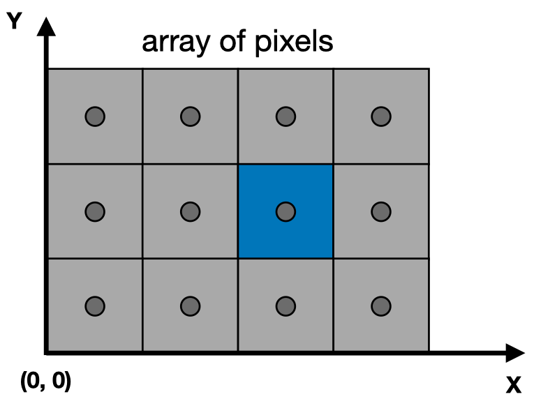

屏幕空间是在屏幕上建立一个坐标系，原点位于屏幕的左下角，+X 向右，+Y 向上。

每个像素以 $ (x, y) $ 的形式来表示（这个坐标表示的是像素的左下角的位置）：

- x 的取值范围是 $ [0, width - 1] $
- y 的取值范围是 $ [0, height - 1] $

如上图的蓝色的像素的位置就是 $ (2,1) $。

另外，我们还要确定每个像素的中心，由于像素的宽高都是 1，因此我们很容易知道每个像素的中心位于 $ (x + 0.5, y + 0.5) $ 的位置上。

要绘制立方体空间，我们首先要把立方体空间变换成屏幕空间中。屏幕没有 Z 方向，所以我们实际上要做的是把立方体空间中的 XY 平面对应 $ [-1, 1]^2 $ 的空间变换成屏幕空间。换句话说，只是把 $ [-1, 1]^2 $ 变换成 $ [0, width] x [0, height] $ 的空间。只需要经过如下的步骤即可实现：

1. 对 $ [-1, 1]^2 $ 进行一次缩放，铺满屏幕
2. 平移空间，使空间的左下角位于原点坐标（缩放后的空间的左下角在 $ (-\frac {width} 2, -\frac {height} 2) $）

因此，这个变换就是：

<div>
$$
\begin{bmatrix}
\frac {width} 2 & 0 & 0 & \frac {width} 2 \\\
0 & \frac {height} 2 & 0 & \frac {height} 2 \\\
0 & 0 & 1 & 0 \\\
0 & 0 & 0 & 1
\end{bmatrix}
$$
</div>


# 三角形

三角形在图形学中应用非常广泛，相比其他图形，它拥有如下性质：

- 复杂图形都能通过三角形组合来表示
- 在空间中的任意三角形的三个顶点都在同一个平面内
- 能很清晰的定义出三角形的内部和外部
- 很容易计算出一个点是位于三角形内部还是外部（通过叉乘）
- 只要定义出三角形的三个顶点的属性，那三角形内部的任意一点都能通过插值的方式计算出对应的属性（通过重心坐标进行插值）


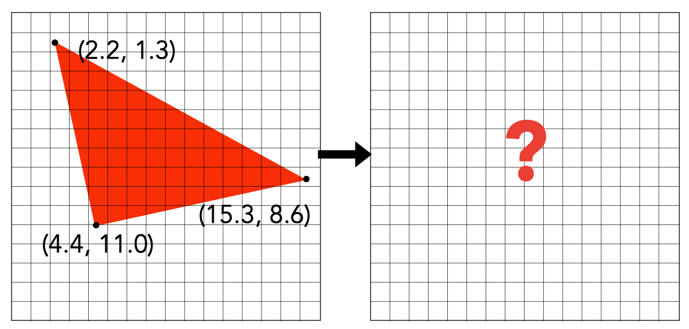

当我们知道了三角形三个顶点的坐标之后，下一步就是决定哪些像素应该被填充了。

如上图所示，三角形内部大部分像素都是被覆盖了的，但边缘位置的像素只是覆盖了一部分，那么应该怎么填充呢？

这就是在光栅化中最重要的概念：**判断一个像素和三角形的位置关系，更确切来说，是判断一个像素中心点与三角形的位置关系。**


# 采样

我们可以通过采样的方式来判断是否应该填充像素。首先要介绍下什么是采样：

采样是把函数离散化的过程。

简单来说就是：给定一个连续函数 $ f(x) $，然后通过一系列的参数如 1、2、3不断代入 $ f(x) $，求出 $ f(1), f(2), f(3) $，这样我们就得到了三个离散的点。这个过程就是在采样了，转换成代码就是：


```c
for (int x = 0; x < xmax; ++x) {
    output[x] = f(x);
}
```

类似的，我们可以通过像素中心对屏幕空间进行采样，判断该像素中心是否被三角形覆盖，以此来判断该像素应不应该被填充。

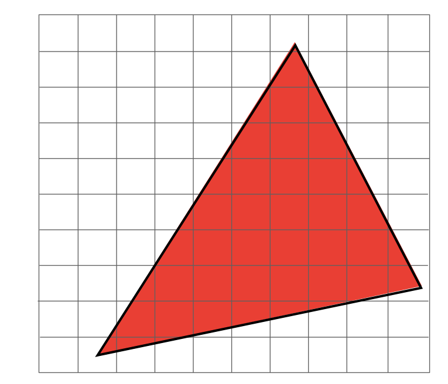

如上图所示的三角形，我们给出一个采样函数：

<div>
$$
inside(triangle, x, y) =

\begin{equation}
\left\{
\begin{array}{lr}
1, 当像素中心位于三角形内部时 \\
0, 否则
\end{array}
\right.
\end{equation}
$$
</div>

如何判断像素中心是否位于三角形内部呢？之前提到过可以利用叉乘的结果来判断，我们来回忆一下：

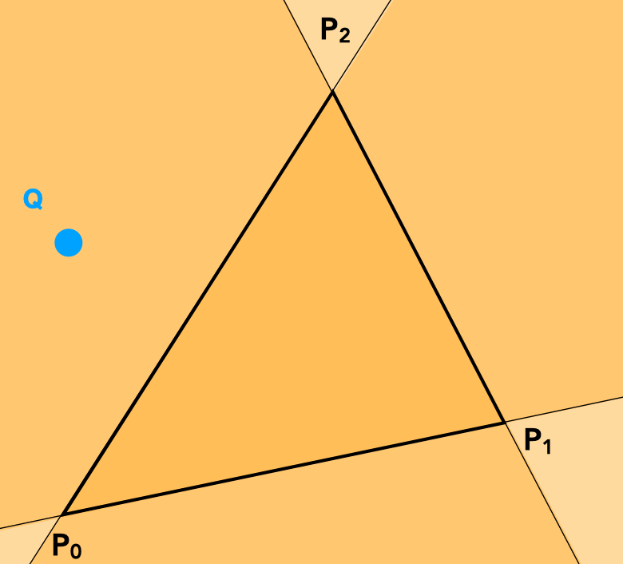

假设三角形的三个顶点分别是 $ P_0，P_1，P_2 $，并且三角形是以逆时针的顺序进行绘制的。那么我们可以求出：

<div>
$$
\vec {P_0 P_1} \times \vec {P_0 Q} \\\
\vec {P_1 P_2} \times \vec {P_1 Q} \\\
\vec {P_2 P_0} \times \vec {P_2 Q} \\\
$$
</div>

根据右手螺旋定则，当得到的三个向量同时为朝外或者同时朝内时，该点会位于三角形内部。

有了采样函数后，我们再对每个像素进行一次采样：

```c
for (int x = 0; x < width; ++x)
    for (int y = 0; y < height; ++y)
        image[x][y] = inside(triangle, x + 0.5, y + 0.5)
```

然而，如果对每个三角形都进行全屏幕采样的话，性能就非常浪费了。

实际上，我们只需要对三角形所在的轴向包围盒子（Axis Align Bounding Box，简称 AABB）覆盖的范围进行采样即可：

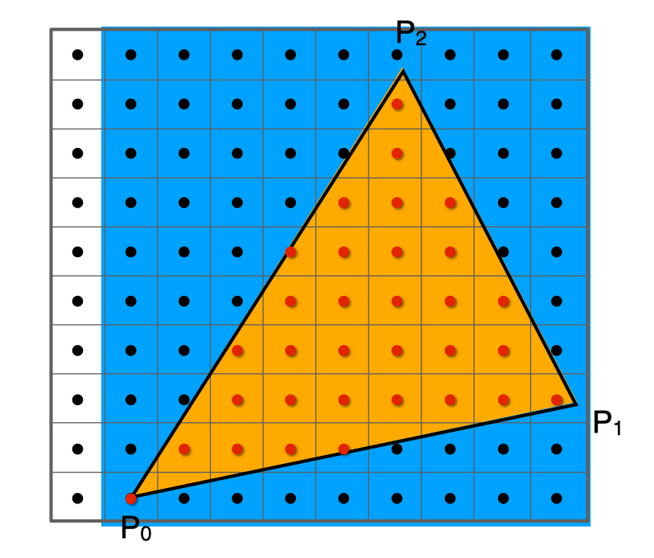

但在极端情况下，例如三角形进行过旋转，或者三角形非常扁，AABB 就会偏大，采样时也会造成浪费。

采样完成后，然后我们就能得到如下的结果：

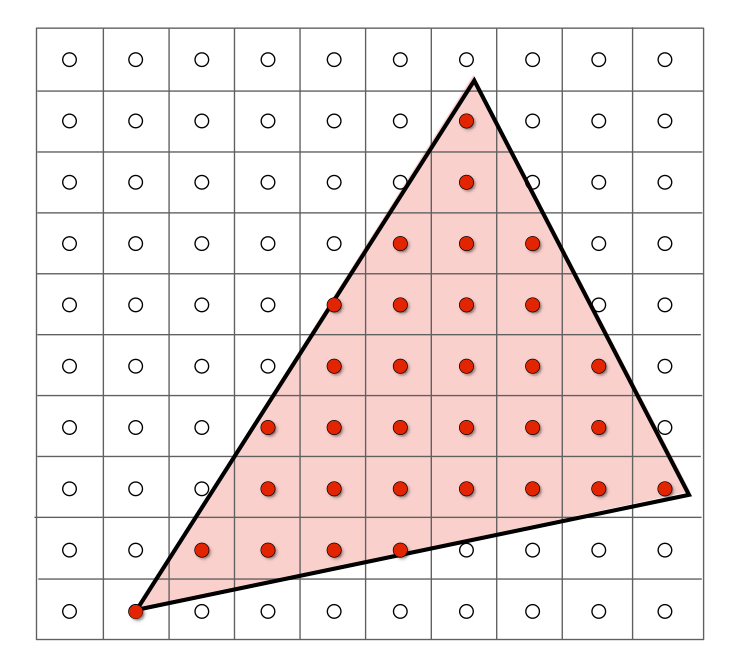

最后，我们对像素进行填充：


得到了一个不太正常的结果，但理论上我们所有的步骤都是正确的，为什么会得到一个充满锯齿的三角形呢？


# 采样理论

在了解锯齿之前，我们先来了解一下什么是采样。 在图形学中，采样是无处不在的。

如光栅化相当于对屏幕中的二维点进行采样、录像相当于对时间进行采样。

在采样过程中，当出现一些不正确的现象时，我们会把这些现象称为走样（`Aliasing`）。常见的有：

- 锯齿

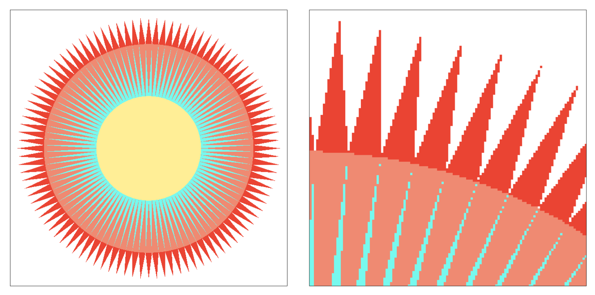

- 摩尔纹（把左图的奇数行列去掉之后，再缩放到原图尺寸就会得到右图）

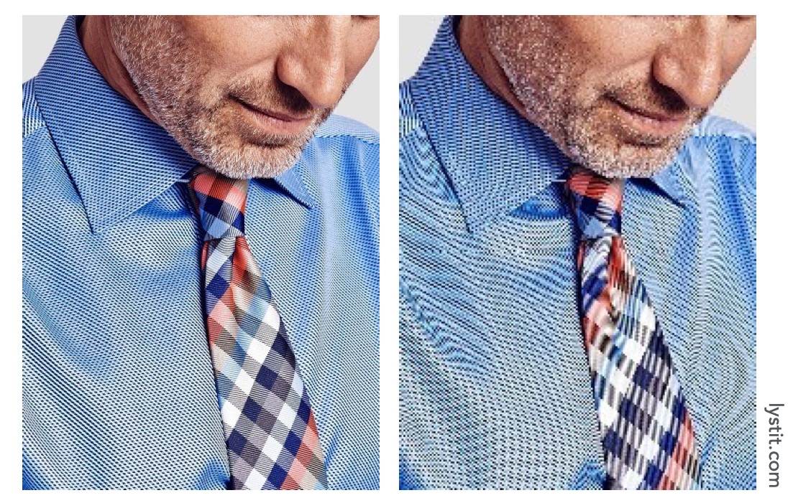

- 车轮错觉（旋转得太快时感觉是往反方向旋转）

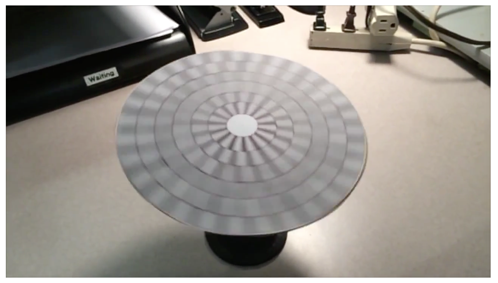

发生这些现象的本质原因是 **信号频率太快，但采样频率太慢**。

要解决上面提到的锯齿现象，我们可以先对原图进行一次模糊处理，然后再进行采样：

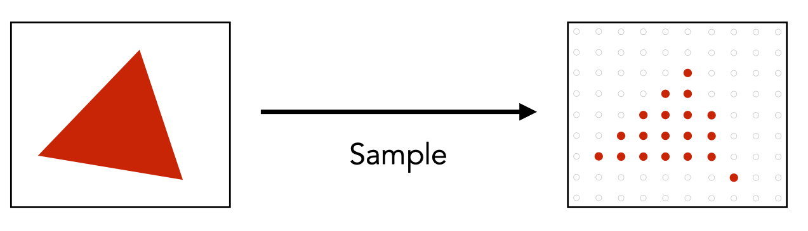

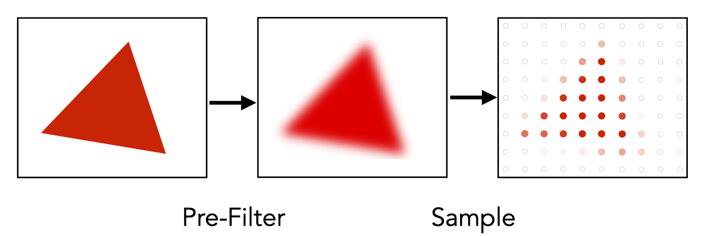

但为什么先进行模糊再采样就能达到抗锯齿的效果呢？


对于一个连续的函数（信号），我们是通过采样来「还原」原来的函数（信号）的。

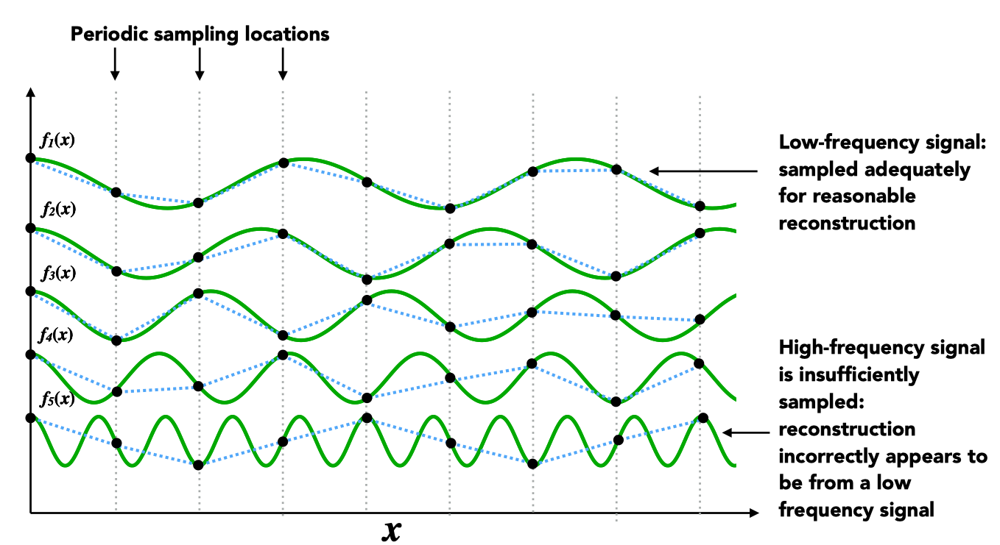

在上图中，有 5 个连续的函数，从 $ f_1 $ 到 $ f_5 $ 的频率渐渐变高。

竖直的虚线表示采样频率。在相同采样频率下，我们对这些函数进行采样，然后把采样后的点连线。 细心观察可以发现：

- 频率越低的函数，采样后的连线与原函数差异越小
- 频率越高的函数，采样后的连线与原函数差异越大

再观察一个极端的例子：

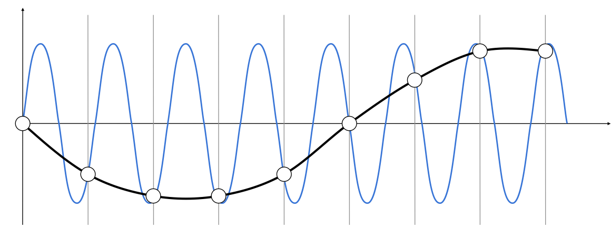

上图对两个函数进行采样，蓝色的是高频函数，黑色的是低频函数。对高频函数采样后的结果（得到的是低频函数）会与低频函数采样结果（得到的是相同的低频函数）一致。

这个例子充分说明：用同一种采样方法，对两个截然不同的信号进行采样，我们可能会得到相同的结果。这就是我们经常说的 —— **走样（alias）**。


# 抗锯齿

锯齿的产生是由于采样率不足，那么我们可以通过以下方式来进行抗锯齿：

- 提高采样率

这是一种终极解决办法，如把 `640x480` 分辨率的屏幕换成 `1920x1080` 分辨率的屏幕，像素变小了，相当于提高了采样率，但这并不现实，我们需要的是在同一块屏幕下实现抗锯齿的方法。

- 反走样

从上面的例子可以知道，我们可以先对图像进行一次模糊操作，再进行采样就可以实现抗锯齿。

在频率上，这种操作相当于先用低通滤波把高频信息过滤掉，再进行采样。这里用的低通滤波就是利用**卷积**求出当前像素和周围像素的平均值。

对于同一个像素，我们知道它原来有多少地方被覆盖了，这时候如果可以先算出覆盖比例，那么我们就可以根据这个比例对像素进行填充了。

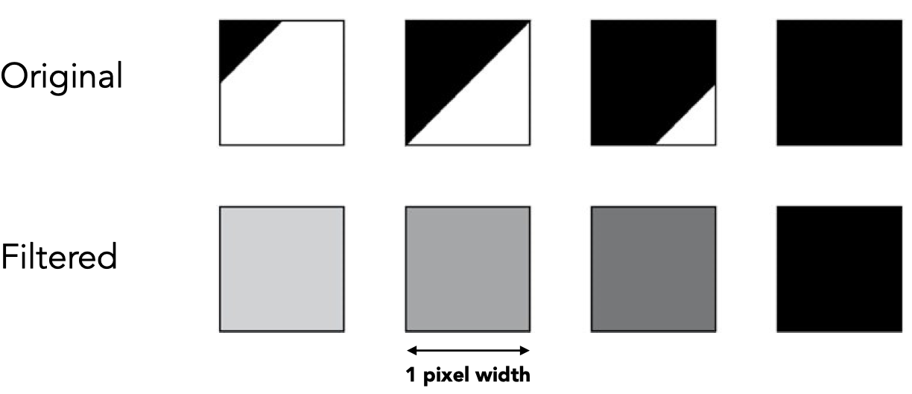

如上图所示：我们可以用肉眼看出四个像素分别被覆盖了 12.5%、50%、87.5%、100%，但屏幕在填充像素是不能只填充一部分的，只能填充一整个像素。因此这时候可以对该像素进行一次平均，最后得到像素的颜色。


# 超采样 （MSAA）

事实上，刚刚提到的计算像素覆盖面积的做法是很难实现的。但我们可以通过超采样的方式来模拟。

所谓的超采样，是指在一个像素里面放多个采样点来检测三角形是否有被覆盖。

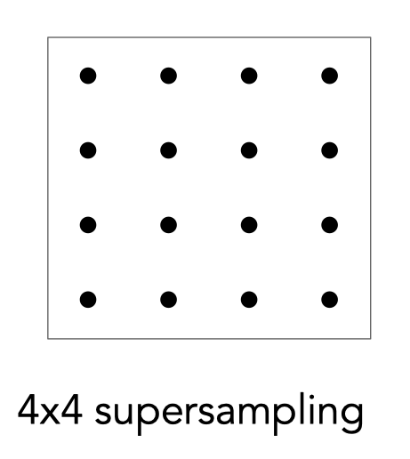

上图表示一个像素里面包含了 16 个采样点，每个采样点采样后再把结果平均起来，最后就能得到三角形对该像素覆盖程度的**近似值**。

如果想要更准确的近似值的话，可以用更多的采样点，但这样计算量就会更大了。

接下来看看实际例子：

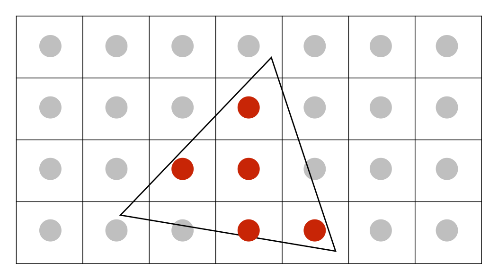

上图中一个像素里面只有一个采样点。

超采样的第一步是要为每个像素增加采样点（2x2）：

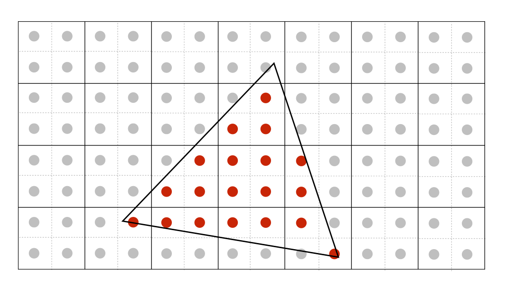

接下来是对每个像素中的所有采样点的结果进行平均：

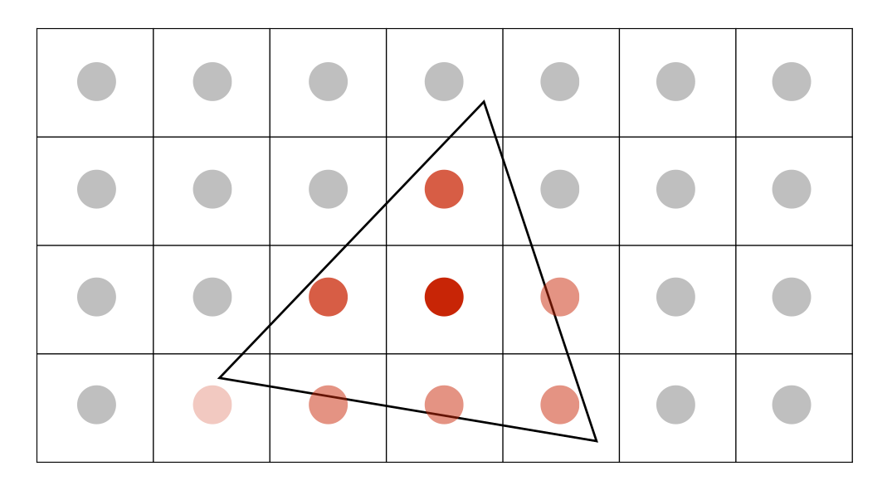

最后就能得到平均后的结果：

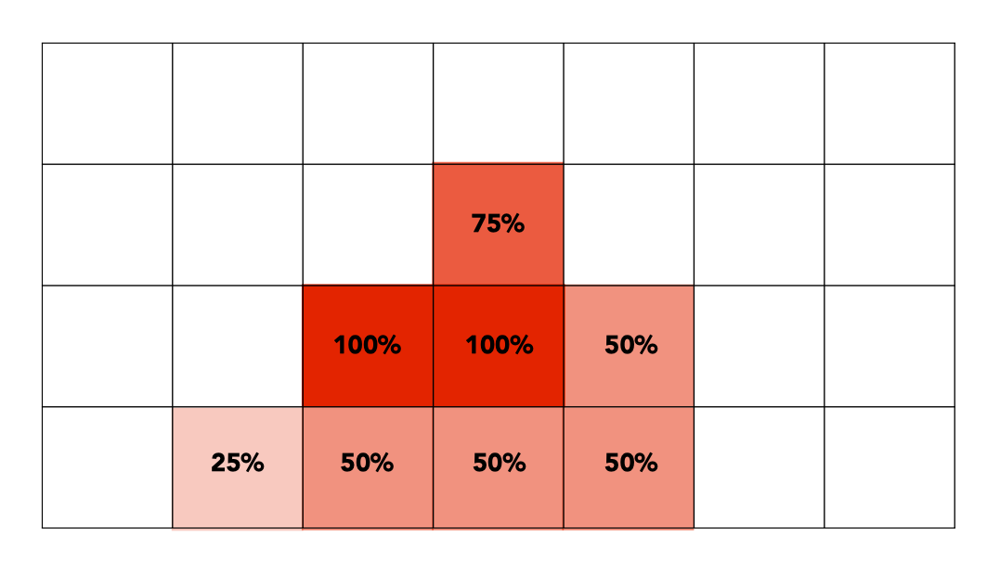

对于 MSAA，我们需要知道如下几点：

- MSAA 是抗锯齿操作的第一步，也就是模糊操作（求平均）。

- MSAA 增加采样点，并不是为了提高采样率（分辨率没有提高），而是为了得到一个更合理的三角形覆盖率。

- MSAA 的代价是计算量大增，如果一个像素里面有4个采样点，那么计算量就大了 4 倍；如果一个像素里面有 16 个采样点，那么计算量就大了 16 倍。（事实上，工业界会会复用、优化这些采样点，因此计算量并没有增加太多）。


# 画家算法

当我们要在屏幕上绘制物体的时候，会涉及到物体与物体间的遮挡问题。最常见的做法是像画家绘画那样，先绘制远处的物体，再绘制近处的物体。

画家算法要求我们先在深度上进行一次排序（需要 $ nlogn $ 的时间），然后再进行绘制。但有些情况是无法通过画家算法来解决的，如下图：

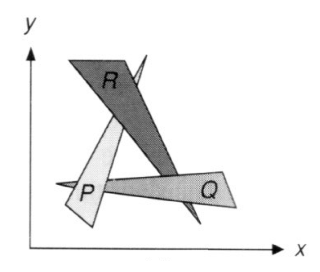

这个例子中，无论怎么排序，都无法得到上图的结果。


# 深度缓冲 （Z-Buffer）

深度缓冲用来记录每个像素的最小深度。

它的工作原理是：每次渲染的时候除了生成最终的图像之外，还生成一张深度图，该深度图记录了每个像素当前的最小深度。

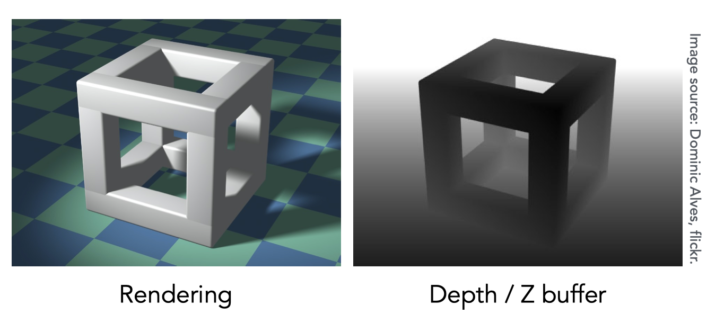


具体实现步骤如下：

1. 初始化所有像素的深度为 $ \infty $
2. 在光栅化过程中，不断更新其深度：


```
for (each triangle T)
    for (each sample(x,y,z) in T)
        if (z < zbuffer[x,y]) {
            framebuffer[x,y] = rgb;
            zbuffer[x,y] = z;
        }
```

对于 n 个三角形，要得到某个像素的最小深度值，我们只需要遍历所有三角形即可，因此其复杂度为 $ O(n) $。

深度缓冲还有以下的好处：

1. 绘制三角形的顺序不影响最终结果
2. 所有 GPU 都支持深度测试

需要注意的是：**深度缓冲并不能处理透明物体**。


# 作业

## 基础

```cpp
static bool insideTriangle(int x, int y, const Vector3f* _v)
{
    Eigen::Vector3f p0 = _v[0];
    Eigen::Vector3f p1 = _v[1];
    Eigen::Vector3f p2 = _v[2];
    Eigen::Vector3f q(x, y, 0);

    Eigen::Vector3f p0p1 = p1 - p0;
    Eigen::Vector3f p1p2 = p2 - p1;
    Eigen::Vector3f p2p0 = p0 - p2;;
    Eigen::Vector3f p0q = q - p0;
    Eigen::Vector3f p1q = q - p1;
    Eigen::Vector3f p2q = q - p2;

    Eigen::Vector3f r0 = p0p1.cross(p0q);
    Eigen::Vector3f r1 = p1p2.cross(p1q);
    Eigen::Vector3f r2 = p2p0.cross(p2q);

    return (r0.z() > 0 && r1.z() > 0 && r2.z() > 0) || (r0.z() < 0 && r1.z() < 0 && r2.z() < 0);
}

void rst::rasterizer::rasterize_triangle(const Triangle& t) {
    auto v = t.toVector4();

    int top = ceil(std::max(v[0].y(), std::max(v[1].y(), v[2].y())));
    int bottom = floor(std::min(v[0].y(), std::min(v[1].y(), v[2].y())));
    int left = floor(std::min(v[0].x(), std::min(v[1].x(), v[2].x())));
    int right = ceil(std::max(v[0].x(), std::max(v[1].x(), v[2].x())));

    for (int x = left; x < right; x++) {
        for (int y = bottom; y < top; y++) {
            if (insideTriangle(x, y, t.v)) {

                auto[alpha, beta, gamma] = computeBarycentric2D(x, y, t.v);
                float w_reciprocal = 1.0/(alpha / v[0].w() + beta / v[1].w() + gamma / v[2].w());
                float z_interpolated = alpha * v[0].z() / v[0].w() + beta * v[1].z() / v[1].w() + gamma * v[2].z() / v[2].w();
                z_interpolated *= w_reciprocal;

                Eigen::Vector3f point(x, y, 0.0);
                auto ind = (height-1-point.y())*width + point.x();

                if (depth_buf[ind] > z_interpolated) {
                    depth_buf[ind] = z_interpolated;
                    set_pixel(point, t.getColor());
                }

            }
        }
    }
}
```


## 提高

```cpp
static bool insideTriangle(float x, float y, const Vector3f* _v)
{
    Eigen::Vector3f p0 = _v[0];
    Eigen::Vector3f p1 = _v[1];
    Eigen::Vector3f p2 = _v[2];
    Eigen::Vector3f q(x, y, 0);

    Eigen::Vector3f p0p1 = p1 - p0;
    Eigen::Vector3f p1p2 = p2 - p1;
    Eigen::Vector3f p2p0 = p0 - p2;;
    Eigen::Vector3f p0q = q - p0;
    Eigen::Vector3f p1q = q - p1;
    Eigen::Vector3f p2q = q - p2;

    Eigen::Vector3f r0 = p0p1.cross(p0q);
    Eigen::Vector3f r1 = p1p2.cross(p1q);
    Eigen::Vector3f r2 = p2p0.cross(p2q);

    return (r0.z() > 0 && r1.z() > 0 && r2.z() > 0) || (r0.z() < 0 && r1.z() < 0 && r2.z() < 0);
}

//Screen space rasterization
void rst::rasterizer::rasterize_triangle(const Triangle& t) {
    auto v = t.toVector4();

    int top = ceil(std::max(v[0].y(), std::max(v[1].y(), v[2].y())));
    int bottom = floor(std::min(v[0].y(), std::min(v[1].y(), v[2].y())));
    int left = floor(std::min(v[0].x(), std::min(v[1].x(), v[2].x())));
    int right = ceil(std::max(v[0].x(), std::max(v[1].x(), v[2].x())));

    float sub_pixels[4][2] = {
        { 0.0, 0.0 },
        { 0.5, 0.0 },
        { 0.0, 0.5 },
        { 0.5, 0.5 }
    };
    int sub_pixels_length = sizeof(sub_pixels) / sizeof(sub_pixels[0]);

    for (int x = left; x < right; x++) {
        for (int y = bottom; y < top; y++) {

            float pass = 0.0;

            for (int i = 0; i < sub_pixels_length; i++) {
                if (insideTriangle(x + sub_pixels[i][0], y + sub_pixels[i][1], t.v)) {
                    pass += 1;
                }
            }

            // NOTE: percent MUST be float, make sure pass or sub_pixels_length is float.
            float percent = pass / sub_pixels_length;

            if (pass > 0) {
                auto[alpha, beta, gamma] = computeBarycentric2D(x, y, t.v);
                float w_reciprocal = 1.0/(alpha / v[0].w() + beta / v[1].w() + gamma / v[2].w());
                float z_interpolated = alpha * v[0].z() / v[0].w() + beta * v[1].z() / v[1].w() + gamma * v[2].z() / v[2].w();
                z_interpolated *= w_reciprocal;

                Eigen::Vector3f color = t.getColor();
                Eigen::Vector3f point(x, y, 0.0);
                auto ind = (height-1-point.y())*width + point.x();

                if (depth_buf[ind] > z_interpolated) {
                    depth_buf[ind] = z_interpolated;
                    color *= percent;
                    set_pixel(point, color);
                }
            }
        }
    }
}

```


# 参考资料

[Lecture 05 Rasterization 1 (Triangles)](https://www.bilibili.com/video/BV1X7411F744?p=5)

[Lecture 06 Rasterization 2 (Antialiasing and Z-Buffering)](https://www.bilibili.com/video/BV1X7411F744?p=6)

[Lecture 07 Shading 1 (Illumination, Shading and 
Graphics Pipeline)](https://www.bilibili.com/video/BV1X7411F744?p=7)
