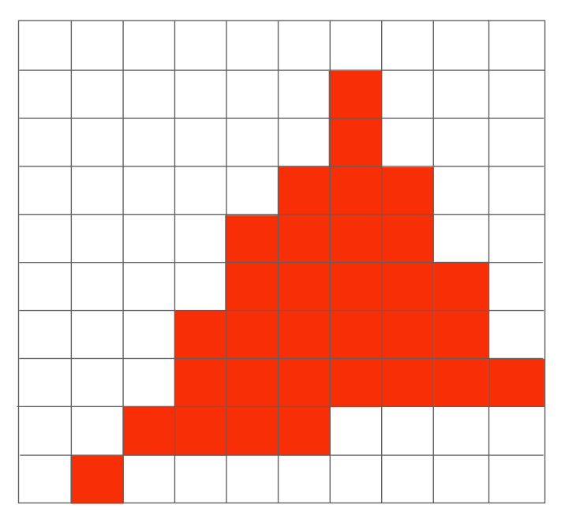

# 简介

本文《GAMES101-现代计算机图形学入门》系列教程的课程笔记，仅用于个人学习使用。


# 屏幕

当进行完 MVP 变换之后，所有需要绘制的点都变换到 $ [-1, 1]^3 $ 的立方体空间中了。 

下一步工作就是要把结果绘制到屏幕上，在这之前先了解一下什么是屏幕。

屏幕由一系列的像素(Pixel，是 Picture element 的缩写)排布形成，像素的数量由分辨率决定，如分辨率是 1920 x 1080 的屏幕，就包含了 1920 x 1080 个像素。

每个像素表示的颜色由红（red）、绿（green）、蓝（blue）三种颜色混合而成。

## 屏幕空间


屏幕空间是在屏幕上建立一个坐标系，原点位于屏幕的左下角，+X 向右，+Y 向上。

每个像素以 $ (x, y) $ 的形式来表示（这个坐标表示的是像素的左下角的位置）：

- x 的取值范围是 $ [0, width - 1] $
- y 的取值范围是 $ [0, height - 1] $

如上图的蓝色的像素的位置就是 $ (2,1) $。

另外，我们还要确定每个像素的中心，由于像素的宽高都是 1，因此我们很容易知道每个像素的中心位于 $ (x + 0.5, y + 0.5) $ 的位置上。

要绘制立方体空间，我们首先要把立方体空间变换成屏幕空间中。屏幕没有 Z 方向，所以我们实际上要做的是把立方体空间中的 XY 平面对应 $ [-1, 1]^2 $ 的空间变换成屏幕空间。换句话说，只是把 $ [-1, 1]^2 $ 变换成 $ [0, width] x [0, height] $ 的空间。只需要经过如下的步骤即可实现：

1. 对 $ [-1, 1]^2 $ 进行一次缩放，铺满屏幕
2. 平移空间，使空间的左下角位于原点坐标（缩放后的空间的左下角在 $ (-\frac {width} 2, -\frac {height} 2) $）

因此，这个变换就是：

<div>
$$
\begin{bmatrix}
\frac {width} 2 & 0 & 0 & \frac {width} 2 \\\
0 & \frac {height} 2 & 0 & \frac {height} 2 \\\
0 & 0 & 1 & 0 \\\
0 & 0 & 0 & 1
\end{bmatrix}
$$
</div>


# 三角形

三角形在图形学中应用非常广泛，相比其他图形，它拥有如下性质：

- 复杂图形都能通过三角形组合来表示
- 在空间中的任意三角形的三个顶点都在同一个平面内
- 能很清晰的定义出三角形的内部和外部
- 很容易计算出一个点是位于三角形内部还是外部（通过叉乘）
- 只要定义出三角形的三个顶点的属性，那三角形内部的任意一点都能通过插值的方式计算出对应的属性（通过重心坐标进行插值）


当我们知道了三角形三个顶点的坐标之后，下一步就是决定哪些像素应该被填充了。

如上图所示，三角形内部大部分像素都是被覆盖了的，但边缘位置的像素只是覆盖了一部分，那么应该怎么填充呢？

这就是在光栅化中最重要的概念：**判断一个像素和三角形的位置关系，更确切来说，是判断一个像素中心点与三角形的位置关系。**


# 采样

我们可以通过采样的方式来判断是否应该填充像素。首先要介绍下什么是采样：

采样是把函数离散化的过程。

简单来说就是：给定一个连续函数 $ f(x) $，然后通过一系列的参数如 1、2、3不断代入 $ f(x) $，求出 $ f(1), f(2), f(3) $，这样我们就得到了三个离散的点。这个过程就是在采样了，转换成代码就是：


```c
for (int x = 0; x < xmax; ++x) {
    output[x] = f(x);
}
```

类似的，我们可以通过像素中心对屏幕空间进行采样，判断该像素中心是否被三角形覆盖，以此来判断该像素应不应该被填充。


如上图所示的三角形，我们给出一个采样函数：

<div>
$$
inside(triangle, x, y) =

\begin{equation}
\left\{
\begin{array}{lr}
1, 当像素中心位于三角形内部时 \\
0, 否则
\end{array}
\right.
\end{equation}
$$
</div>

如何判断像素中心是否位于三角形内部呢？之前提到过可以利用叉乘的结果来判断，我们来回忆一下：


假设三角形的三个顶点分别是 $ P_0，P_1，P_2 $，并且三角形是以逆时针的顺序进行绘制的。那么我们可以求出：

<div>
$$
\vec {P_0 P_1} \times \vec {P_0 Q} \\\
\vec {P_1 P_2} \times \vec {P_1 Q} \\\
\vec {P_2 P_0} \times \vec {P_2 Q} \\\
$$
</div>

根据右手螺旋定则，当得到的三个向量同时为朝外或者同时朝内时，该点会位于三角形内部。

有了采样函数后，我们再对每个像素进行一次采样：

```c
for (int x = 0; x < width; ++x)
    for (int y = 0; y < height; ++y)
        image[x][y] = inside(triangle, x + 0.5, y + 0.5)
```

然而，如果对每个三角形都进行全屏幕采样的话，性能就非常浪费了。实际上，我们只需要对三角形所在的轴向包围盒子（Axis Align Bounding Box，简称 AABB）覆盖的范围进行采样即可：


但在极端情况下，例如三角形进行过旋转，或者三角形非常扁，AABB 就会偏大，采样时也会造成浪费。

采样完成后，然后我们就能得到如下的结果：


最后，我们对像素进行填充：



得到了一个不太正常的结果，但理论上我们所有的步骤都是正确的，为什么会得到一个充满锯齿的三角形呢？


# 走样

# 参考资料

[Lecture 05 Rasterization 1 (Triangles)](https://www.bilibili.com/video/BV1X7411F744?p=5)

[Lecture 06 Rasterization 2 (Antialiasing and Z-Buffering)](https://www.bilibili.com/video/BV1X7411F744?p=6)
