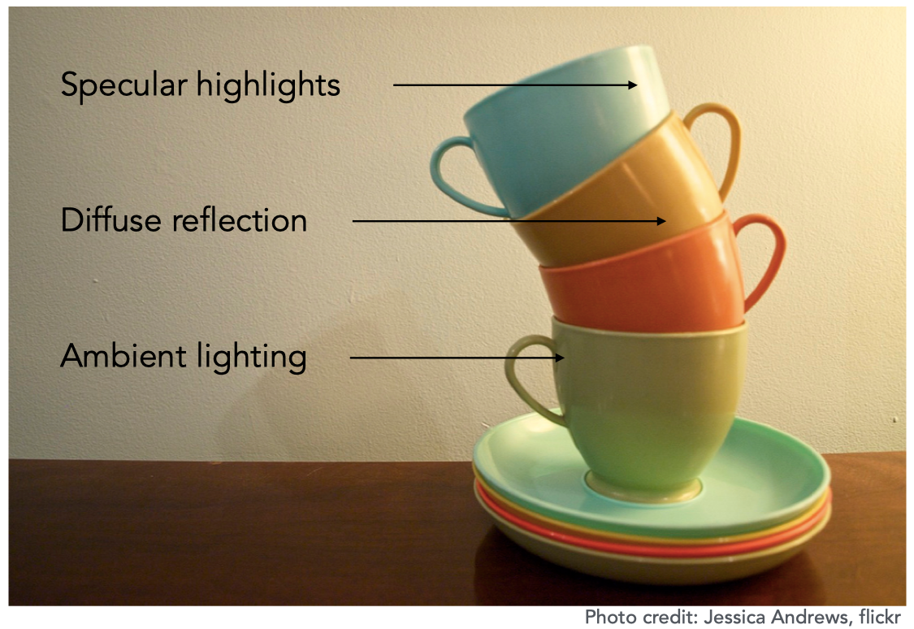
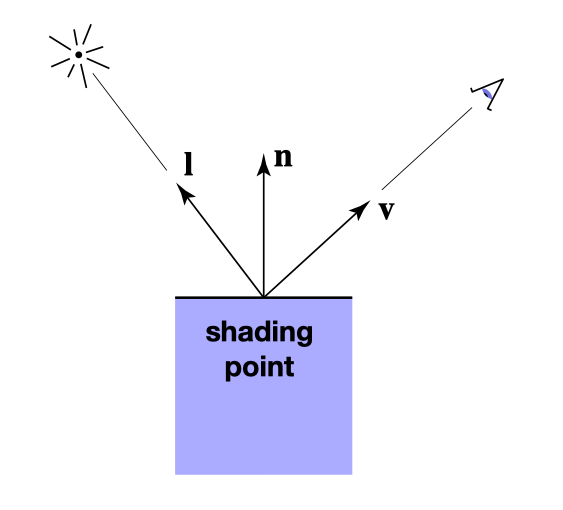
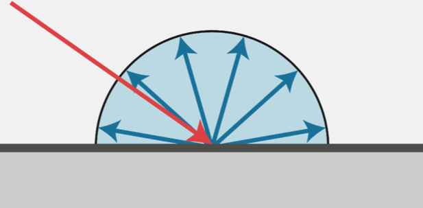
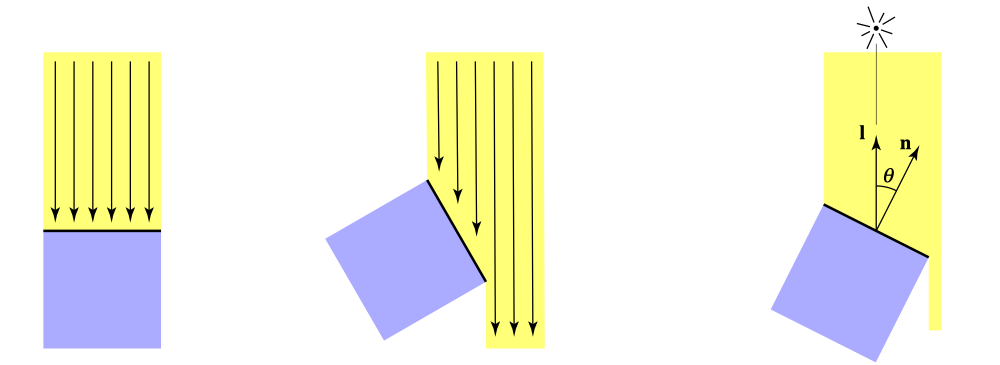
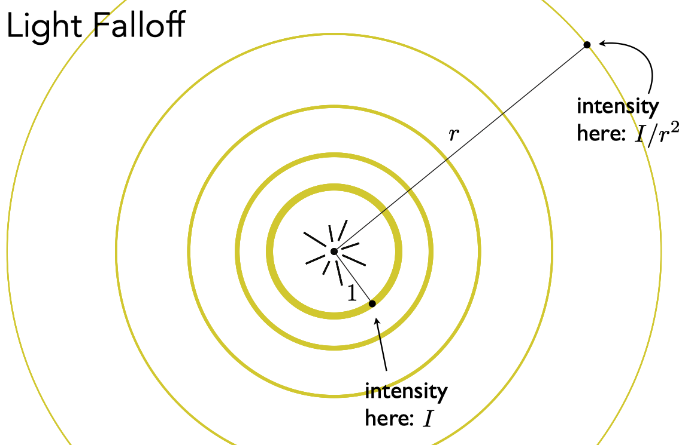

# 简介

本文《GAMES101-现代计算机图形学入门》系列教程的课程笔记，仅用于个人学习使用。

# 着色（Shading）

在本课程中，着色指的是为物体应用材质。

# Blinn-Phong 着色模型

Blinn-Phong 着色模型主要有三部分组成：

- Diffuse （漫反射）：由物体本身的颜色决定
- Specular （高光）：由观察角度与光线反射角度共同决定，两者夹角越小，高光越明显
- Ambient （环境光）：由环境决定

对于每个着色点，我们可以简化成如下图所示：

其中有：

- n 表示表面法线方向
- l 表示入射光方向
- v 表示观察方向

**注意：所有向量都是单位向量，所以确保向量进行过 normalize 操作。**

另外，着色过程中是不会产生阴影的，阴影是通过其他技术手段来生成的。

## 漫反射 （Diffuse）

漫反射是指光线照射在物体表面后会往四周反射的现象。

细心的同学会发现，上图中的入射光线和反射光线的颜色是不同的，这是因为当入射光线到达物体表面时，物体表面会吸收一部分能量，然后反射它没有吸收的能量（暂时不考虑折射），也就是物体本身的颜色。

从能量的角度考虑，只有当有能量到达物体表面时，物体才能发生漫反射，那么接下来的问题是，怎么知道有多少能量到达物体表面呢？

观察上图，假设光线是离散的。

左图中的光线与平面法线平行，平面接受了所有光线的能量（6根光线）。

中图中的光线与平面法线夹角为 60度，平面只接受了一半光线的能量（3根光线）。

推广到一般情况下，平面能接受的能量与该平面的法线和入射光的角度有关。其关系是：

$$
平面接受的能量的百分比 = cos(n, l) = n \cdot l
$$

接下来的问题是，能量从哪里来？以点光源为例，它的能量是从中心外四周扩散的，如下图所示：

假设传播过程中能量守恒，这意味着在半径为 1 时的能量等于半径为 r 时的能量，均为 E。然而，随着半径的增大，球面的表面积也在增大，相当于球面中单位面积的能量减少了。

我们知道，球面的表面积公式为：

$$
S = 4 \pi r^2
$$

假设单位面积的能量为 I，那么半径为 1 时的能量为：

$$
E = I_{1} \times 4 \pi
$$

半径为 r 时的能量为：

$$
E = I_{r} \times 4 \pi r^2
$$

那么我们就能得到半径为 r 时的单位面积的能量了：

$$
I_{r} = \frac {I_1} {r^2}
$$

知道了半径为 r 时的单位面积的能量，就相当于知道了有多少能量能到达平面了。

最后，我们来整理一下漫反射公式：

$$
到达着色点的能量 = \frac {I} {r^2}
$$

$$
被着色点吸收的能量的百分比 = max(0, n \cdot l)
$$

因此：

$$
L_d = k_d \cdot (\frac I {r^2}) \cdot max(0, n \cdot l)
$$

其中：

- $ k_d $ 表示材质的漫反射系数，可调节
- $ L_d $ 表示着色点的漫反射分量

# 参考资料

[Lecture 07 Shading 1 (Illumination, Shading and 
Graphics Pipeline)](https://www.bilibili.com/video/BV1X7411F744?p=8)

[Lecture 08 Shading 2 (Shading, Pipeline and Texture Mapping)](https://www.bilibili.com/video/BV1X7411F744?p=9)

[Lecture 09 Shading 3 (Texture Mapping Cont.)](https://www.bilibili.com/video/BV1X7411F744?p=10)
