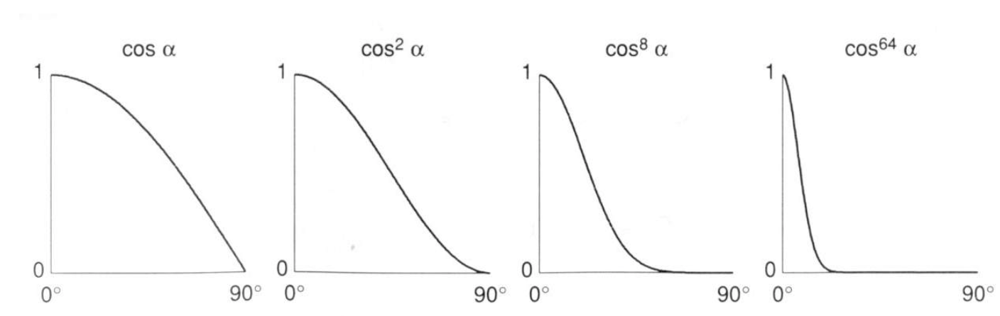
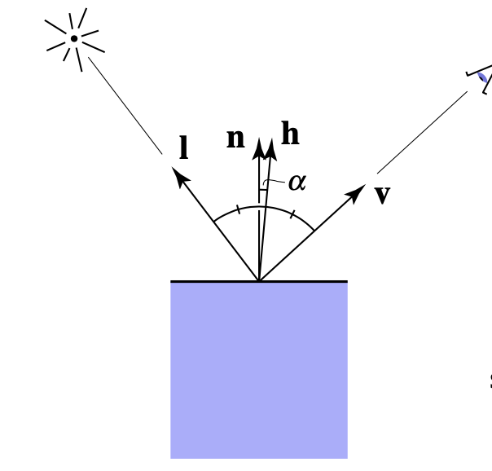
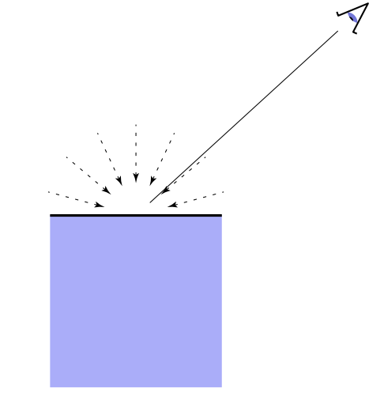
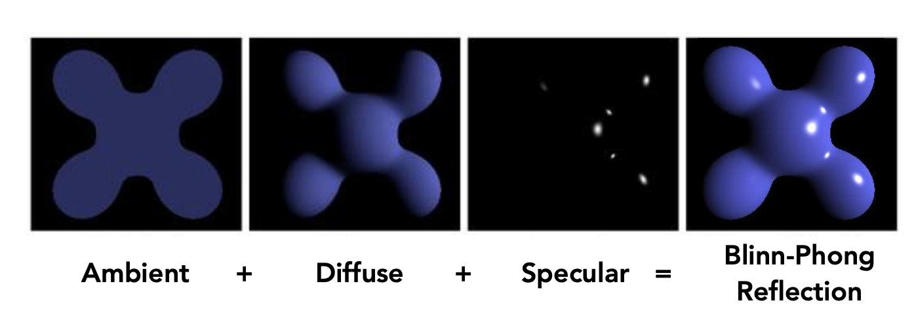
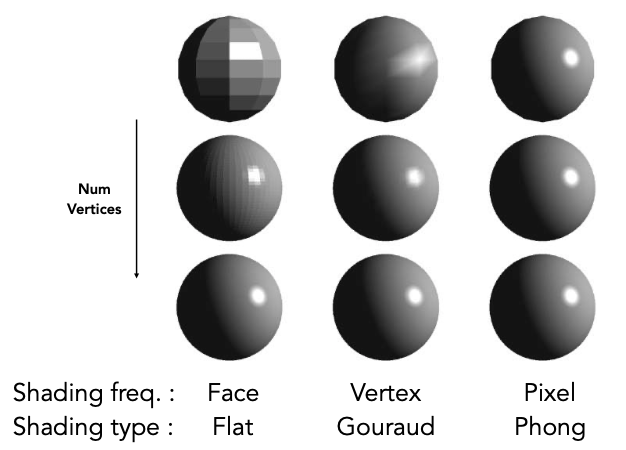
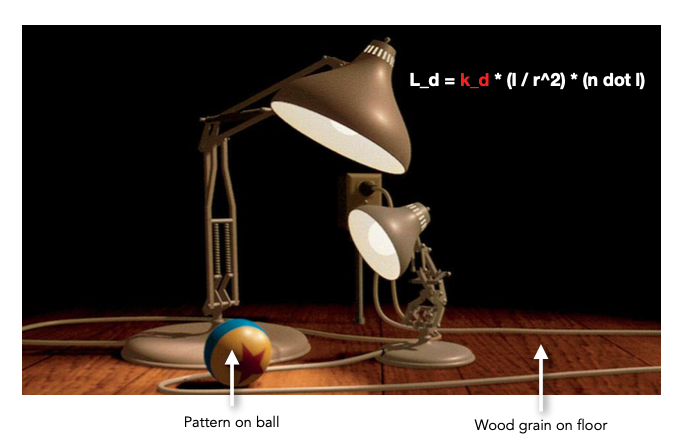
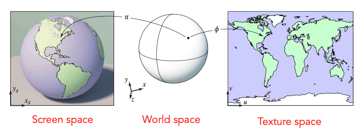
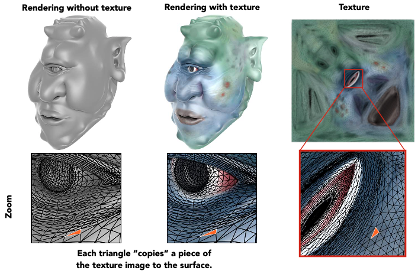

# 简介

本文《GAMES101-现代计算机图形学入门》系列教程的课程笔记，仅用于个人学习使用。

# 着色（Shading）

在本课程中，着色指的是为物体应用材质。

# Blinn-Phong 着色模型

Blinn-Phong 着色模型主要有三部分组成：

- Diffuse （漫反射）：由物体本身的颜色决定
- Specular （高光）：由观察角度与光线反射角度共同决定，两者夹角越小，高光越明显
- Ambient （环境光）：由环境决定

对于每个着色点，我们可以简化成如下图所示：

其中有：

- n 表示表面法线方向
- l 表示入射光方向
- v 表示观察方向

**注意：所有向量都是单位向量，所以确保向量进行过 normalize 操作。**

另外，着色过程中是不会产生阴影的，阴影是通过其他技术手段来生成的。

## 漫反射 （Diffuse）

漫反射是指光线照射在物体表面后会往四周反射的现象。

细心的同学会发现，上图中的入射光线和反射光线的颜色是不同的，这是因为当入射光线到达物体表面时，物体表面会吸收一部分能量，然后反射它没有吸收的能量（暂时不考虑折射），也就是物体本身的颜色。

从能量的角度考虑，只有当有能量到达物体表面时，物体才能发生漫反射，那么接下来的问题是，怎么知道有多少能量到达物体表面呢？

观察上图，假设光线是离散的。

左图中的光线与平面法线平行，平面接受了所有光线的能量（6根光线）。

中图中的光线与平面法线夹角为 60度，平面只接受了一半光线的能量（3根光线）。

推广到一般情况下，平面能接受的能量与该平面的法线和入射光的角度有关。其关系是：

$$
平面接受的能量的百分比 = cos(n, l) = n \cdot l
$$

接下来的问题是，能量从哪里来？以点光源为例，它的能量是从中心外四周扩散的，如下图所示：

假设传播过程中能量守恒，这意味着在半径为 1 时的能量等于半径为 r 时的能量，均为 E。然而，随着半径的增大，球面的表面积也在增大，相当于球面中单位面积的能量减少了。

我们知道，球面的表面积公式为：

$$
S = 4 \pi r^2
$$

假设单位面积的能量为 I，那么半径为 1 时的能量为：

$$
E = I_{1} \times 4 \pi
$$

半径为 r 时的能量为：

$$
E = I_{r} \times 4 \pi r^2
$$

那么我们就能得到半径为 r 时的单位面积的能量了：

$$
I_{r} = \frac {I_1} {r^2}
$$

知道了半径为 r 时的单位面积的能量，就相当于知道了有多少能量能到达平面了。

最后，我们来整理一下漫反射公式：

$$
到达着色点的能量 = \frac {I} {r^2}
$$

$$
被着色点吸收的能量的百分比 = max(0, n \cdot l)
$$

因此：

$$
L_d = k_d \cdot (\frac I {r^2}) \cdot max(0, n \cdot l)
$$

其中：

- $ L_d $ 表示着色点的漫反射分量
- $ k_d $ 表示材质的漫反射系数，可调节

## 高光（Specular）

当光线发生反射时，如果当前视角方向与反射方向接近时，我们就能看到高光了。

和漫反射公式类似，我们也需要知道有多少能量到达了平面，有多少能量被反射出去了，不同的地方是我们需要求视角方向与反射方向的夹角。

观察上图，我们能通过向量的几何意义得出：

$$
\vec {OR} = \vec {IR} - \vec {IO}
$$

$$
\vec {OR} = 2 \vec {P} - \vec {IO}
$$

$$
\vec {P} = \vec {IO} + \vec {S}
$$

接下来需要求 $ \vec S $，由于 $ \theta $ 是 $ \vec {OI} $ 与 $ \vec {ON} $ 的夹角，所以计算时需要把 $ \vec {IO} $ 取反。

另外由于点乘的结果是个标量，所以需要乘以法线才能得到 $ \vec S $：

$$
\vec {S} = \vec {ON} (-\vec {IO} \cdot \theta) = -\vec {ON} (\vec {IO} \cdot \vec {ON})
$$

把 $ \vec S $ 代入上面的式子得：

$$
\vec {OR} = 2(\vec {IO} - \vec {ON} (\vec {IO} \cdot \vec {ON})) - \vec {IO}
$$

化简得：

$$
\vec {OR} = \vec {IO} - 2 \vec {ON} (\vec {IO} \cdot \vec {ON}))
$$

调整一下入射光 $ \vec {IO} $ 的方向，使之朝外，并使 $ \vec {OR} = \vec r $、$ \vec {OI} = \vec l $、$ \vec {ON} = \vec n $，于是我们就能得到反射公式：

$$
\vec r = 2 (\vec l \cdot \vec n) - \vec l
$$

于是我们能得到类似的公式：

$$
L_s = k_s \cdot (\frac I {r^2}) \cdot max(0, v \cdot r)
$$

由于 Phong 着色模型只是经验模型，并没有考虑太多的物理意义，因此在计算高光的时候并没有像漫反射公式那样考虑有多少能量被吸收了，因此就舍弃了 $ max(0, n \cdot l) $ 部分。

然而，上面公式计算反射光与视角夹角时会得到一个 0~90 度的范围，这意味着在这个范围中都能看到高光，这显然不符合高光的定义。因此需要对该部分进行修正：

可以看到，如果对 $ cos $ 进行指数运算，我们能很容易的调整高光可视范围的阈值，因此可以把该公式修正成：

$$
L_s = k_s \cdot (\frac I {r^2}) \cdot max(0, v \cdot r)^p
$$

其中：

- $ L_s $ 表示着色点的高光分量
- $ k_s $ 表示材质的高光系数，可调节
- $ p $ 用来调节高光的可视范围

Blinn Phong 着色模型在这基础上进行了优化：当反射向量与视角向量相近时，这相当于视角与入射光的 **半程向量** 与法线的夹角相近：

于是我们可以用半程向量与法线的夹角，可以代替反射向量与视角的夹角，并且半程向量的计算也非常简单：

$$
\vec h = \frac {\vec l + \vec v} {||\vec l + \vec v||}
$$

这样就能对刚才的高光公式调整成：

$$
L_s = k_s \cdot (\frac I {r^2}) \cdot max(0, n \cdot h)^p
$$

## 环境光（Ambient）

对于没有光线直接照射的平面（如最开始的茶杯的背光位置），该平面依旧会受到环境中各种光照的反射，这就是环境光对场景的影响。

我们可以近似地认为场景中的环境光是个常量，它表示来自场景中各个方向的光线的总和，并且不受视角方向的影响，于是有：

$$
L_a = k_a I_a
$$

其中：

- $ L_a $ 表示着色点的环境光分量
- $ k_a $ 表示材质的环境光系数，可调节
- $ I_a $ 表示场景的环境光强度

当我们计算出漫反射、高光、环境光之后，把它们加起来，就能得到 Blinn Phong 着色模型的结果了：

Blinn Phong 的着色公式为：

$$
L = L_a + L_d + L_s
$$

$$
L = k_a I_a + k_d(\frac {I} {r^2}) max(0, n \cdot l) + k_s(\frac {I} {r^2}) max(0, n \cdot h)^p
$$

# 着色频率

着色频率指的是发生着色的频率，如上图所示，上面三个球都拥有相同的几何形状，但应用了不同的着色频率，分别是：平面着色（左）、高洛德着色（中）、冯氏着色（右）。

## 平面着色（Flat）

平面着色是指整个三角面中共用一个方向的法线，因此表现为整个三角面的颜色都是一样的。

## 高洛德着色（Gouraud）

高洛德着色是指三角面中三个顶点分别拥有自己的法线，然后在着色时先计算出这三个顶点的颜色，然后其他像素就以插值的方式去计算出其对应的颜色。

## 冯氏着色（Phong）

冯氏着色是指三角面的三个顶点分别拥有自己的法线，然后其他像素也通过插值的方式计算出其对应的法线，然后每个像素都能进行着色。

## 对比

如图所示，着色频率对结果的影响，取决于模型的复杂度。模型的复杂度越低，着色结果区别越大，但随着模型复杂度的提高，平面着色也可以达到冯氏着色的效果。因此我们不能迷信冯氏着色一定比平面着色好。

# 纹理映射（Texture Mapping）

根据着色公示，我们能计算出每个像素的颜色。但如果我们想要模型显示出更加复杂的颜色呢？例如把一张图片贴到物体表面，如上图中的球和地面那样，它们并不是简单的光照颜色，而是复杂的颜色，这种复杂的颜色看起来是来自于某张纹理的。

回顾漫反射公式中，我们可以通过改变 $ k_d $ 来调整漫反射分量，当这个 $ k_d $ 包含了纹理中某个区域的颜色时，这其实就相当于把该纹理应用到着色公式中了。

事实上，我们的确是通过某种方式找到物体表面与纹理的关系的，物体表面的某一个三角面对应了纹理中的个区域：

如上图所示，在屏幕空间中的任意一点，我们都能找到它在贴图空间中对应的位置，这个对应关系就是 **纹理映射**。

由于任意一个三维物体它都是由二维的三角面构成的，因此我们可以利用这个性质，来建立空间中的三角形与二维纹理中的映射关系。 这项工作通常是在建模软件中完成的。

接下来的问题是，如何表示这个对应关系呢？答案是 **UV坐标**。

UV 坐标是指以纹理左下角为原点来建立的二维坐标系，横坐标为 U，纵坐标为 V，它们的取值范围都是 $ [0, 1] $，这个取值范围与贴图尺寸无关，即纹理最大宽高在 UV 中都是表示为 1。

只要三角形中的每个顶点都保存了一个 UV 坐标的信息，那么在着色的时候就可以通过 UV 坐标找到该纹理对应的区域，这样就可以实现应用纹理的效果了。

# 参考资料

[Lecture 07 Shading 1 (Illumination, Shading and 
Graphics Pipeline)](https://www.bilibili.com/video/BV1X7411F744?p=8)

[Lecture 08 Shading 2 (Shading, Pipeline and Texture Mapping)](https://www.bilibili.com/video/BV1X7411F744?p=9)

[Lecture 09 Shading 3 (Texture Mapping Cont.)](https://www.bilibili.com/video/BV1X7411F744?p=10)

[求反射向量](https://www.cnblogs.com/graphics/archive/2013/02/21/2920627.html)
