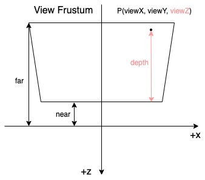

# 空间变换


上图是 OpenGL 中的变换过程，可以用下面几行代码来描述：

```glsl
attribute vec3 localPosition;
// local space -> world space
vec4 worldPosition = modelMatrix * vec4(localPosition, 1.0);
// world space -> view space
vec4 viewPosiion = viewMatrix * worldPosition;
// view space -> clip space
vec4 clipPosition = projectionMatrix * viewPosition;
// clip space -> ndc space
vec3 ndcPosition = clipPosition.xyz / clipPosition.w;
// ndc space -> screen space
gl_FragCoord = vec3(
  (ndcPosition.x + 1) * width / 2 + x,
  (ndcPosition.y + 1) * height / 2 + y,
  (ndcPosition.z + 1) * (far - near) / 2 + near
);

```

整个过程中对深度影响最大的是投影变换，下文将详细介绍投影与深度之间的关系。


# 投影变换

投影变换是利用投影矩阵对顶点进行变换的过程，而投影矩阵分为透视矩阵和正交矩阵(证明过程可以看看[songho](http://www.songho.ca/opengl/gl_projectionmatrix.html))。

- 透视矩阵

<div>
$$
\begin{bmatrix}
{\frac {2n} {r-l}} & 0 & {\frac {r+l} {r-l}} & 0 \\
0 & {\frac {2n} {t-b}} & {\frac {t+b} {t-b}} & 0 \\
0 & 0 & {\frac {-(f + n)} {f - n}} & {\frac {-2fn} {f - n}} \\
0 & 0 & -1 & 0
\end{bmatrix}
$$
</div>

- 正交矩阵

<div>
$$
\begin{bmatrix}
{\frac {2} {r-l}} & 0 & 0 & -{\frac {r+l} {r-l}} \\
0 & {\frac {2} {t-b}} & 0 & -{\frac {t+b} {t-b}} \\
0 & 0 & {\frac {-2} {f-n}} & -{\frac {f+n} {f-n}} \\
0 & 0 & 0 & 1
\end{bmatrix}
$$
</div>

<div>

假设 view space 下的某一点的齐次坐标为 $ (X_{view}, Y_{view}, Z_{view}, 1.0) $ ，第三行第三列为 A，第三行第四列为 B，那么 clip space 下的 Z 可以表示成：

$$
Z_{clip} = A Z_{view} + B
$$

从 clip space 变换成 ndc space 时，需要执行透视除法，那么就有：
</div>

## 透视投影变换

<div>
$$
W_{clip} = -Z_{view}
$$

$$
Z_{ndc} = \frac {Z_{clip}}  {W_{clip}} = \frac {A Z_{view} + B} {-Z_{view}} = -A - \frac B {Z_{view}}
$$
</div>

## 正交投影变换

<div>
$$
W_{clip} = W_{view} = 1.0
$$

$$
Z_{ndc} = \frac {Z_{clip}} {W_{clip}} = A {Z_{view}} + B
$$
</div>


<div>
在 ndc space 中，$ Z_{ndc} $ 的取值范围为 [-1, 1]。当我们需要把它保存到 Z buffer 中时，需要把取值范围变换成 [0, 1]：

$$
Z_{buffer} = Z_{ndc} \times 0.5 + 0.5
$$

</div>

这就是我们经常看的**深度缓冲（Z Buffer）** 了。


# 深度与 View Z

**深度**指的是一个点到近平面的距离。

**View Z** 指的是 view space 下的 Z 值，也就是刚刚一直提到的 $ Z_{view} $。深度与View Z 的关系大概可以用下图来表示：



由于 `depth`、`near`、`far` 都是表示距离的，因此它们都是非负的。而 `View Z` 则是处于 view space 下，因此它是一个负值，它的取值范围是 $ [-\infty, 0] $。

通常 `near` 和 `far` 都是有用户决定的，而 `depth` 是根据顶点的位置动态计算的。在 view space 下，`depth` 的变化是线性的，但在 clip space 下，就要分情况讨论了。

- 当使用正交投影时，深度是线性变化的。
- 当使用透视投影时，深度是非线性变化的。

为什么会出现这种差异呢？我们看看刚才投影前后的关系就可以了：

对于正交投影来说，ndc space 和 view space 下的 Z 有如下的关系：

<div>
$$
Z_{ndc} = A {Z_{view}} + B
$$
</div>

这是一个 $ y = ax + b $ 的线性变化形式，因此变换后的深度是线性变化的。

而对于透视投影来说，ndc space 和 view space 的关系就变成了：

<div>
$$
Z_{ndc} = -A - \frac B {Z_{view}}
$$
</div>

这是一个 $ y = \frac a x + b $ 的形式，因此变换后的深度不是线性变化的。

因此，如果我们要准确比较两个顶点之间的深度时，需要变换到 view space 下进行比较。


# 深度缓冲（Z Buffer）

**深度缓冲**指的是最终在 Z buffer 中的值，它的作用是用来记录当前 fragment 的深度值，取值范围是 $ [0, 1] $，在近平面的值为 0，远平面的值为 1，换句话说，离镜头越近，深度值越小，离镜头越远，深度值越大。

但 $ Z_{ndc} $ 的取值范围是 $ [-1, 1] $，显然需要再进行一次变换才能把它的取值范围变成 $ [0, 1] $，这个变换就是刚刚提到过的：

<div>
$$
Z_{buffer} = Z_{ndc} \times 0.5 + 0.5
$$
</div>

这个深度缓冲最重要的作用是为深度测试提供了条件。


除此之外，我们也可以从深度缓冲 $ Z_{buffer} $ 计算出变换前的坐标。

<div>

先把深度缓冲变换到 ndc space 中：

$$
Z_{ndc} = Z_{buffer} \times 2.0 - 1.0
$$

再把 ndc space 变换到 clip space：

$$
Z_{clip} = Z_{ndc} \times W_{clip}
$$

但这个过程要用到 $ Z_{view} $ 和 $ W_{clip} $，不同的投影矩阵会有不同的计算过程。

</div>

## 从透视投影求 View Z

<div>

从前面的式子可以知道， 对于透视投影变换，$ Z_{ndc} $ 和 $ Z_{view} $ 有如下的关系：

$$
Z_{ndc} = -A - \frac B {Z_{view}}
$$

把这个式子处理一下：

$$
Z_{view} = \frac {-B} {A+Z_{ndc}}
$$

把 A 和 B 都展开，就可以得到：

$$
Z_{view} = \frac {2fn} {Z_{ndc}(f-n) - (f+n)}
$$

我们还可以用 $ Z_{buffer} $ 代替 $ Z_{ndc} $，这样就可以得到：


$$
Z_{view} = \frac {2fn} {(2Z_{buffer} - 1)(f-n) - (f+n)} = \frac {fn} {Z_{buffer}(f-n) - f}
$$
</div>

> 由于 $ Z_{buffer} $ 的取值范围是 $ [0, 1] $，$ f > n > 0 $。

> 因此 $ Z_{buffer}(f - n) - f $ 是一个负值。

> 这里求出的 $ Z_{view} $ 也是一个负值，这满足了 View Z 是一个负值的前提。

> 有些文章会用这个公式把 Z buffer 转化成线性深度，由于线性深度是非负的，因此他们会把公式的分母部分 * -1，于是就会得到：

> $ \frac {2fn} {(f+n) - Z_{ndc}(f-n)} $

> 或者是

> $ \frac {fn} {f - Z_{buffer}(f-n)} $ 


## 从正交投影求 View Z

<div>
对于正交投影变换，$ Z_{ndc} $ 和 $ Z_{view} $ 有如下的关系：


$$
Z_{ndc} = A Z_{view} + B
$$

处理一下：

$$
Z_{view} = \frac {Z_{ndc} - B} {A}
$$

把 A 和 B 都展开：

$$
Z_{view} = \frac {Z_{ndc}(f-n)+(f+n)} {-2}
$$

再用 $ Z_{buffer} $ 代替 $ Z_{ndc} $：

$$
Z_{view} = \frac {(2Z_{buffer} - 1)(f-n)+(f+n)} {-2} = Z_{buffer}(n-f) - n
$$
</div>

> 和上面从透视投影求 View Z 类似，有些文章会把公式改成

> $ n - Z_{buffer}(n - f) $


## 计算 clip space 下的 W

<div>
从上面的公式中我们可以从 $ Z_{ndc} $ 或者 $ Z_{buffer} $ 中计算出 $ Z_{view} $，然后就可以计算出 $ W_{clip} $ 了。

假设 $ P_{43} $ 表示投影矩阵的第四行第三列，$ P_{44} $ 表示第四行第四列，根据矩阵乘法的计算我们可以得到：

$$
W_{clip} = P_{43} \times Z_{view} + P_{44}
$$

把 $ P_{43} $ 和 $ P_{44} $ 代入之后就可以得到：

</div>


<div>
当矩阵为透视矩阵的时候 $ W_{clip} = -Z_{view} $；
</div>

<div>
当矩阵为正交矩阵的时候 $ W_{clip} = 1.0 $。
</div>

<div>
有了 $ W_{clip} $ 后，我们不仅能计算出 $ Z_{clip} $，我们也可以计算出当前 fragment 在 clip space 和 view space 下的坐标。
</div>


## 计算 view space 下的坐标

<div>

假设 $ P_{ndc} $ 、$ P_{clip} $ 、$ P_{view} $ 分别表示 P 点在 ndc space、clip space、view space 下的位置，$ W_{clip} $ 表示 P 点在齐次坐标的 W 分量在 clip space 下的值， $ M_{projection} $、 $ M_{projection}^{-1}$ 分别表示投影矩阵、投影矩阵的逆矩阵。

</div>

<div>
因为：

$$
P_{clip} = M_{projection} \times P_{view}
$$

$$
P_{ndc} = P_{clip} / W_{clip}
$$

所以：

$$
P_{clip} = P_{ndc} \times W_{clip}
$$

$$
P_{view} = M_{projection}^{-1} \times P_{clip}
$$
</div>

翻译成 GLSL 代码就是：

```glsl
// NOTE: 外部传递进来的变量
uniform float near;
uniform float far;
uniform mat4 projectionMatrix;
uniform mat4 projectionInverseMatrix;
uniform sampler2D depthMap;

varying vec2 uv;

void main() {

    // NOTE: 假设要绘制一个铺满屏幕的矩形，uv 刚好可以用来表示它的屏幕坐标，取值范围是 [0, 1]
    vec2 screenPosition = uv;
    float zBuffer = texture2D(depthMap, uv).r;
    // NOTE: 假设用透视投影
    float viewZ = (far * near) / ((far - near) * zBuffer - far);
    float clipW = projectionMatrix[2][3] * viewZ + projection[3][3]; // NOTE: Az + B
    vec3 ndcPosition = vec3(screenPosition, zBuffer) * 2.0 - 1.0;
    vec4 clipPosition = vec4(ndcPosition, 1.0) * clipW;
    vec4 viewPosition = projectionInverseMatrix * clipPosition;
    
    // ...

}
```


# 参考资料

[Coordinate Systems](https://learnopengl.com/Getting-started/Coordinate-Systems)

[OpenGL Projection Matrix](http://www.songho.ca/opengl/gl_projectionmatrix.html)

[Linear Depth](http://dev.theomader.com/linear-depth/)

[Learning to Love your Z-buffer](https://www.sjbaker.org/steve/omniv/love_your_z_buffer.html)

[Real depth in OpenGL / GLSL](http://web.archive.org/web/20130416194336/http://olivers.posterous.com/linear-depth-in-glsl-for-real)

[Reconstructing Position From Depth](https://therealmjp.github.io/posts/reconstructing-position-from-depth/)

[How Does a camera convert from clip space into screen space?](https://stackoverflow.com/questions/57938025/how-does-a-camera-convert-from-clip-space-into-screen-space/57938288#57938288)

[为什么透视计算的深度是非线性深度](https://www.cnblogs.com/pbblog/p/3484193.html)
